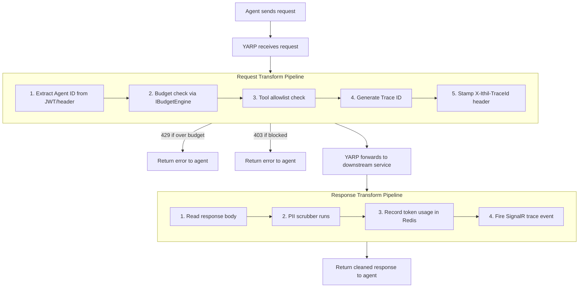

# Feature: YARP Gateway Host

## What It Is

The main entry point for all agent traffic. A YARP-based ASP.NET Core application that intercepts every inbound request, runs a pipeline of transforms (auth, budget, trace header injection), forwards the request to the appropriate C# microservice, and runs response transforms (PII scrub, usage recording, trace event emission) before returning to the agent.

YARP handles raw HTTP forwarding. Ithil adds governance logic inside YARP's transform hooks.

---

## Flow



---

## Acceptance Criteria

- [ ] Gateway starts and serves traffic on port 443 (HTTPS) and 80 (HTTP redirect)
- [ ] All requests without a valid agent identity receive `401`
- [ ] Requests from agents over their daily token budget receive `429`
- [ ] Requests to tools not in the agent's allowlist receive `403`
- [ ] All forwarded requests carry `X-Ithil-TraceId` header
- [ ] Gateway health check endpoint (`/health`) returns `200` with no auth required
- [ ] Route configuration is loaded from `appsettings.json` `ReverseProxy` section
- [ ] The transform pipeline does not catch and suppress exceptions silently — unhandled errors return `500` and fire a trace event with `status: error`
- [ ] Response body is always read, scrubbed, and re-written — original body stream is never passed through directly

---

## Files & Functions

```
Ithil.Gateway/
├── Program.cs
│   └── Main entry — wires DI, YARP, transforms, endpoints
│       Functions used: AddReverseProxy(), AddTransforms(), MapReverseProxy(),
│                       MapMcpEndpoints(), MapManagementApi(), MapHealthChecks()
│
├── Transforms/
│   ├── RequestTransformPipeline.cs
│   │   └── class RequestTransformPipeline
│   │       └── TransformAsync(RequestTransformContext ctx) → Task
│   │           Calls: IAgentIdentityService.ResolveAgentAsync()
│   │                  IBudgetEngine.IsWithinBudgetAsync()
│   │                  IToolAllowlistService.IsAllowedAsync()
│   │                  ITraceIdFactory.Create()
│   │
│   └── ResponseTransformPipeline.cs
│       └── class ResponseTransformPipeline
│           └── TransformAsync(ResponseTransformContext ctx) → Task
│               Calls: IPrivacyFilter.ScrubAsync()
│                      IBudgetEngine.RecordUsageAsync()
│                      ITraceNotifier.NotifyAsync()
│
└── ServiceCollectionExtensions.cs
    └── static AddIthilServices(IServiceCollection, IConfiguration) → IServiceCollection
        Registers: IBudgetEngine, IPrivacyFilter, IAgentIdentityService,
                   ITraceIdFactory, ITraceNotifier, IToolAllowlistService

Ithil.Core/
└── Interfaces/
    ├── IAgentIdentityService.cs   → ResolveAgentAsync(HttpContext) → Option<AgentIdentity>
    ├── IBudgetEngine.cs           → IsWithinBudgetAsync(string agentId) → Task<bool>
    │                              → RecordUsageAsync(string agentId, int tokens) → Task
    ├── IToolAllowlistService.cs   → IsAllowedAsync(string agentId, string toolName) → Task<bool>
    ├── ITraceIdFactory.cs         → Create() → string
    ├── ITraceNotifier.cs          → NotifyAsync(AgentTraceEvent) → Task
    └── IPrivacyFilter.cs          → ScrubAsync(Stream body) → Task<string>
```

---

## Unit Testing Plan

Tests live in `Ithil.Gateway.Tests/`.

### Test: RequestTransform_ReturnsUnauthorized_WhenAgentNotResolved
- Mock `IAgentIdentityService.ResolveAgentAsync()` to return `None`
- Call `TransformAsync()`
- Assert response status is `401`
- Assert no downstream call was made

### Test: RequestTransform_ReturnsTooManyRequests_WhenBudgetExceeded
- Mock agent identity resolves successfully
- Mock `IBudgetEngine.IsWithinBudgetAsync()` returns `false`
- Assert response status is `429`

### Test: RequestTransform_ReturnsForbidden_WhenToolNotAllowed
- Mock agent identity and budget both pass
- Mock `IToolAllowlistService.IsAllowedAsync()` returns `false`
- Assert response status is `403`

### Test: RequestTransform_StampsTraceIdHeader_WhenAllChecksPass
- All mocks return success
- Assert forwarded request contains `X-Ithil-TraceId` header with a non-empty value

### Test: ResponseTransform_CallsScrubber
- Mock a response body stream with PII content
- Assert `IPrivacyFilter.ScrubAsync()` was called once

### Test: ResponseTransform_RecordsUsage_AfterScrub
- Assert `IBudgetEngine.RecordUsageAsync()` is called after scrub completes, not before

### Test: ResponseTransform_FiresTraceEvent
- Assert `ITraceNotifier.NotifyAsync()` is called with an event that has the correct `traceId` and `agentId`

### Test: HealthCheck_Returns200_WithNoAuth
- Call `GET /health` without any authorization header
- Assert `200 OK`
