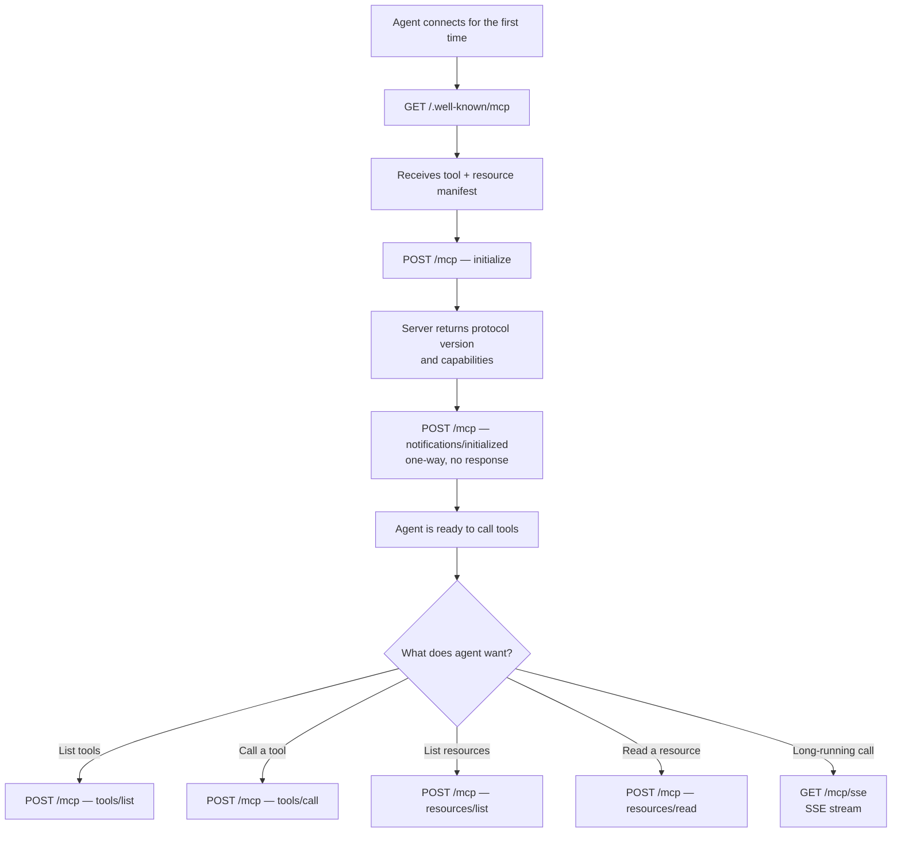
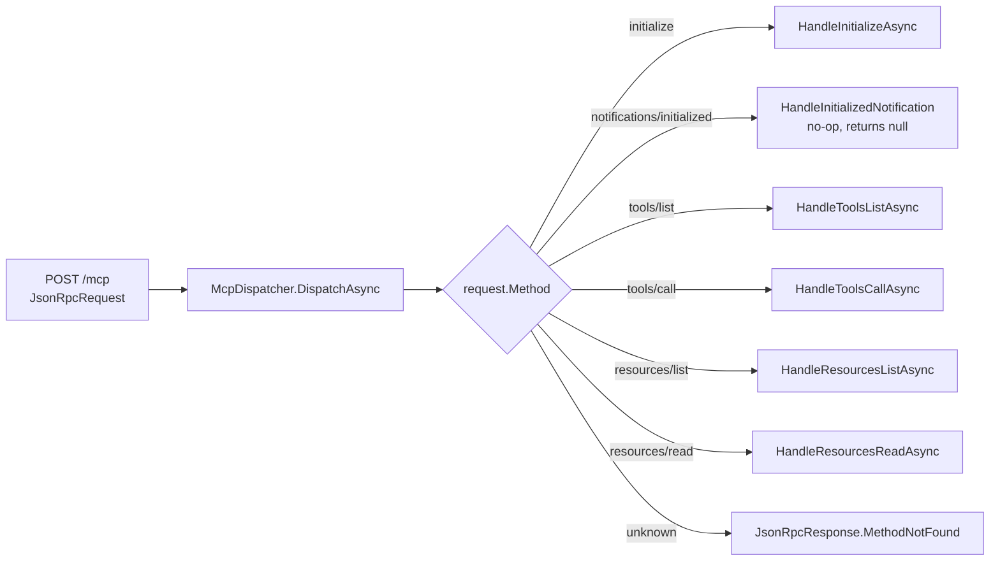

# Feature: MCP Endpoints

## What It Is

The agent-facing API layer. Exposes three endpoints:

1. `GET /.well-known/mcp` — discovery, returns the full tool + resource manifest, no auth required
2. `POST /mcp` — all JSON-RPC 2.0 traffic (initialize, tools/list, tools/call, resources/list, resources/read)
3. `GET /mcp/sse` — Server-Sent Events stream for long-running tool responses

MCP uses JSON-RPC 2.0, not REST. Every call is a POST; the action is in the `method` field of the JSON body. HTTP verbs don't express intent here — `method` does.

---

## Protocol Flow



---

## JSON-RPC Dispatch



---

## Acceptance Criteria

- [ ] `GET /.well-known/mcp` returns a valid JSON manifest with `tools` and `resources` arrays, no auth required
- [ ] `POST /mcp` without a valid token returns `401`
- [ ] `POST /mcp` with `method: "initialize"` returns protocol version `"2024-11-05"` and capabilities
- [ ] `POST /mcp` with `method: "notifications/initialized"` returns no body (one-way notification)
- [ ] `POST /mcp` with an unknown method returns a JSON-RPC `MethodNotFound` error (`code: -32601`)
- [ ] `POST /mcp` with `method: "tools/list"` returns only tools the authenticated agent is allowed to call
- [ ] `POST /mcp` with `method: "tools/call"` routes to the correct downstream endpoint via YARP
- [ ] `GET /mcp/sse` sets `Content-Type: text/event-stream` and `Cache-Control: no-cache`
- [ ] All JSON-RPC responses include `"jsonrpc": "2.0"` and echo the request `id`

---

## Files & Functions

```
Ithil.Gateway/
├── Endpoints/
│   ├── McpEndpointExtensions.cs
│   │   └── static MapMcpEndpoints(IEndpointRouteBuilder) → IEndpointRouteBuilder
│   │       Registers: GET /.well-known/mcp
│   │                  POST /mcp
│   │                  GET /mcp/sse
│   │
│   └── SseEmitter.cs
│       └── class SseEmitter : ISseEmitter
│           └── StreamAsync(HttpContext ctx) → Task
│               Holds the SSE connection open and writes events as they arrive
│
└── Mcp/
    ├── McpDispatcher.cs
    │   └── class McpDispatcher : IMcpDispatcher
    │       └── DispatchAsync(JsonRpcRequest, HttpContext) → Task<JsonRpcResponse>
    │           Calls: HandleInitializeAsync()
    │                  HandleInitializedNotification()
    │                  HandleToolsListAsync()
    │                  HandleToolsCallAsync()
    │                  HandleResourcesListAsync()
    │                  HandleResourcesReadAsync()
    │
    └── Handlers/
        ├── InitializeHandler.cs       → HandleInitializeAsync(JsonRpcRequest) → JsonRpcResponse
        ├── ToolsListHandler.cs        → HandleToolsListAsync(JsonRpcRequest, string agentId) → JsonRpcResponse
        ├── ToolsCallHandler.cs        → HandleToolsCallAsync(JsonRpcRequest, HttpContext) → JsonRpcResponse
        ├── ResourcesListHandler.cs    → HandleResourcesListAsync(JsonRpcRequest) → JsonRpcResponse
        └── ResourcesReadHandler.cs    → HandleResourcesReadAsync(JsonRpcRequest) → JsonRpcResponse

Ithil.Core/
└── Models/
    ├── JsonRpcRequest.cs
    │   └── record JsonRpcRequest
    │       ├── string Jsonrpc   (must be "2.0")
    │       ├── string Id
    │       ├── string Method
    │       └── JsonElement? Params
    │
    ├── JsonRpcResponse.cs
    │   └── record JsonRpcResponse
    │       ├── string Jsonrpc   (always "2.0")
    │       ├── string Id
    │       ├── object? Result
    │       └── JsonRpcError? Error
    │       static MethodNotFound(string id) → JsonRpcResponse
    │
    └── JsonRpcError.cs
        └── record JsonRpcError
            ├── int Code
            └── string Message
```

---

## Unit Testing Plan

Tests live in `Ithil.Gateway.Tests/Mcp/`.

### Test: Dispatcher_ReturnsInitializeResponse_WithProtocolVersion
- Call `DispatchAsync()` with `method: "initialize"`
- Assert result contains `protocolVersion: "2024-11-05"`
- Assert result contains `serverInfo.name: "Ithil"`

### Test: Dispatcher_ReturnsNull_ForInitializedNotification
- Call `DispatchAsync()` with `method: "notifications/initialized"`
- Assert result is null or empty (one-way notification, no response)

### Test: Dispatcher_ReturnsMethodNotFound_ForUnknownMethod
- Call `DispatchAsync()` with `method: "totally/unknown"`
- Assert error code is `-32601`

### Test: Dispatcher_ReturnsToolsList_FilteredByAgentAllowlist
- Register two tools: `GetInventory` (allowed) and `DeleteUser` (not in allowlist)
- Call `DispatchAsync()` with `method: "tools/list"` for a specific agent
- Assert response contains only `GetInventory`

### Test: WellKnownMcp_Returns200_WithNoAuth
- Call `GET /.well-known/mcp` without any headers
- Assert `200 OK`
- Assert response body contains `"tools"` array

### Test: McpPost_Returns401_WithNoToken
- Call `POST /mcp` with no Authorization header
- Assert `401 Unauthorized`

### Test: JsonRpcResponse_AlwaysIncludesJsonrpcVersion
- Create any `JsonRpcResponse`
- Assert `Jsonrpc == "2.0"`

### Test: JsonRpcResponse_EchoesRequestId
- Create `JsonRpcRequest` with `id: "test-123"`
- Dispatch it
- Assert response `Id == "test-123"`
