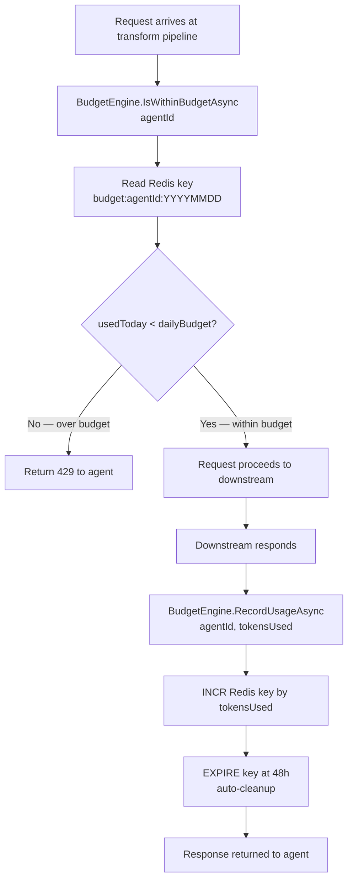

# Feature: Budget Engine

## What It Is

A Redis-backed token ledger that tracks how many tokens each agent has consumed today and enforces a configurable daily cap. Runs inside the YARP request transform — if an agent is over budget, the request is rejected with `429` before it touches any downstream service.

Token counts reset automatically at UTC midnight via Redis key TTL.

---

## Flow



---

## Key Design Decisions

- **Per-day key format:** `budget:{agentId}:{yyyyMMdd}` — one key per agent per UTC day. Expires after 48 hours so we keep yesterday for reporting but don't accumulate forever.
- **Atomic increments:** Redis `INCR` is atomic. No race condition when multiple requests from the same agent arrive simultaneously.
- **Token estimation:** At request time we don't know actual token usage yet. We check budget before forwarding. We record actual usage after the response. This means an agent can slightly overshoot if many concurrent requests all pass the pre-check before any usage is recorded. This is acceptable — daily budgets are not financial transactions.
- **Agent config location:** Daily budget limit is stored in the agent record (see `AgentIdentity` feature), fetched by agent ID.

---

## Acceptance Criteria

- [ ] `IsWithinBudgetAsync` returns `true` when the agent has used fewer tokens than their daily limit
- [ ] `IsWithinBudgetAsync` returns `false` when the agent is at or over their daily limit
- [ ] `IsWithinBudgetAsync` returns `true` for an agent with no prior usage today (key doesn't exist yet)
- [ ] `RecordUsageAsync` increments the Redis counter by the exact number of tokens passed
- [ ] `RecordUsageAsync` sets a 48-hour TTL on the key (idempotent — resetting TTL on every write is fine)
- [ ] Token counts reset on a new UTC day (different date in key = different counter)
- [ ] `GetUsageAsync` returns the current token count for an agent for today (used by dashboard)
- [ ] If Redis is unreachable, `IsWithinBudgetAsync` fails open (returns `true`) and logs an error — don't block all agents because Redis is down

---

## Files & Functions

```
Ithil.Budget/
├── BudgetEngine.cs
│   └── class BudgetEngine : IBudgetEngine
│       ├── IsWithinBudgetAsync(string agentId) → Task<bool>
│       │   Reads: Redis key budget:{agentId}:{today}
│       │   Reads: agent daily limit from IAgentConfigRepository
│       │   Returns: usedToday < dailyLimit
│       │
│       ├── RecordUsageAsync(string agentId, int tokensUsed) → Task
│       │   Writes: INCR budget:{agentId}:{today} by tokensUsed
│       │   Writes: EXPIRE budget:{agentId}:{today} 48h
│       │
│       └── GetUsageAsync(string agentId) → Task<int>
│           Reads: Redis key budget:{agentId}:{today}
│           Returns: current token count (0 if key not found)
│
├── BudgetKeyFactory.cs
│   └── static class BudgetKeyFactory
│       └── ForToday(string agentId) → string
│           Returns: $"budget:{agentId}:{DateTime.UtcNow:yyyyMMdd}"
│
└── BudgetEngineOptions.cs
    └── class BudgetEngineOptions
        └── bool FailOpenOnRedisError   (default: true)

Ithil.Core/
└── Interfaces/
    └── IBudgetEngine.cs
        ├── IsWithinBudgetAsync(string agentId) → Task<bool>
        ├── RecordUsageAsync(string agentId, int tokensUsed) → Task
        └── GetUsageAsync(string agentId) → Task<int>
```

---

## Unit Testing Plan

Tests live in `Ithil.Budget.Tests/`. Use a Redis test double (mock `IDatabase`) — no real Redis required for unit tests.

### Test: IsWithinBudget_ReturnsTrue_WhenNoUsageToday
- Mock Redis returns `null` for the budget key (key doesn't exist)
- Agent daily limit is `50000`
- Assert `IsWithinBudgetAsync` returns `true`

### Test: IsWithinBudget_ReturnsTrue_WhenUnderLimit
- Mock Redis returns `12400` for the budget key
- Agent daily limit is `50000`
- Assert `IsWithinBudgetAsync` returns `true`

### Test: IsWithinBudget_ReturnsFalse_WhenAtLimit
- Mock Redis returns `50000`
- Agent daily limit is `50000`
- Assert `IsWithinBudgetAsync` returns `false`

### Test: IsWithinBudget_ReturnsFalse_WhenOverLimit
- Mock Redis returns `51000`
- Agent daily limit is `50000`
- Assert `IsWithinBudgetAsync` returns `false`

### Test: RecordUsage_IncrementsCorrectKey
- Call `RecordUsageAsync("agent-01", 312)`
- Assert `IDatabase.StringIncrementAsync` was called with key `"budget:agent-01:{today}"` and value `312`

### Test: RecordUsage_SetsExpiry_After48Hours
- Call `RecordUsageAsync("agent-01", 100)`
- Assert `IDatabase.KeyExpireAsync` was called with `TimeSpan.FromDays(2)`

### Test: GetUsage_ReturnsZero_WhenKeyNotFound
- Mock Redis returns `null`
- Assert `GetUsageAsync` returns `0`

### Test: IsWithinBudget_FailsOpen_WhenRedisThrows
- Mock Redis throws `RedisConnectionException`
- Assert `IsWithinBudgetAsync` returns `true` (fail open)
- Assert error is logged via `ILogger`

### Test: BudgetKeyFactory_UsesTodaysDate
- Call `BudgetKeyFactory.ForToday("agent-01")`
- Assert key contains today's UTC date in `yyyyMMdd` format

### Test: BudgetKeyFactory_DifferentDate_DifferentKey
- Key generated today differs from key generated for yesterday
- Assert the two keys are not equal
