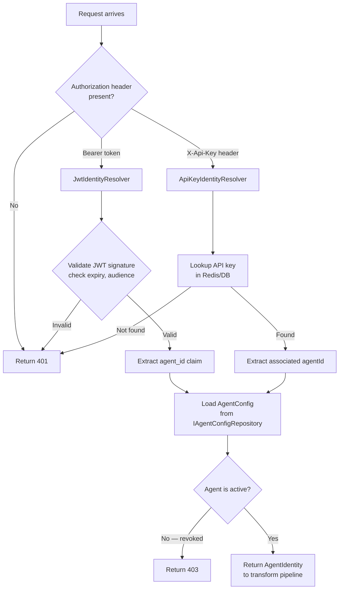

# Feature: Agent Identity & Authentication

## What It Is

The system that identifies which agent is making a request and verifies that identity before any other middleware runs. Supports two mechanisms: JWT tokens (enterprise, OIDC-backed) and API keys (self-serve developer tier).

Every subsequent feature — budgets, allowlists, tracing, audit logs — depends on a verified agent ID. This is the foundation.

---

## Flow



---

## Acceptance Criteria

- [ ] A valid JWT with `agent_id` claim resolves to the corresponding `AgentIdentity`
- [ ] An expired JWT returns `401`
- [ ] A JWT with an invalid signature returns `401`
- [ ] A valid API key in `X-Api-Key` header resolves to the corresponding `AgentIdentity`
- [ ] An unknown API key returns `401`
- [ ] A revoked agent (active = false) returns `403` even with a valid token
- [ ] OIDC authority URL, audience, and issuer are configurable via `appsettings.json`
- [ ] API keys are stored hashed in the store (never plaintext) — comparison uses constant-time equality
- [ ] `AgentIdentity` carries: `agentId`, `label`, `dailyTokenBudget`, `allowedTools`, `isActive`
- [ ] The resolver does not log the token or API key value (only the agent ID after resolution)

---

## Files & Functions

```
Ithil.Gateway/
└── Identity/
    ├── AgentIdentityService.cs
    │   └── class AgentIdentityService : IAgentIdentityService
    │       └── ResolveAgentAsync(HttpContext ctx) → Task<Option<AgentIdentity>>
    │           Tries: JwtIdentityResolver first
    │           Falls back to: ApiKeyIdentityResolver
    │           Then: loads AgentConfig from IAgentConfigRepository
    │           Then: checks IsActive
    │
    ├── JwtIdentityResolver.cs
    │   └── class JwtIdentityResolver
    │       └── TryResolveAsync(HttpContext ctx) → Task<Option<string>>
    │           Reads: Authorization: Bearer header
    │           Validates: signature, expiry, audience via JwtBearerOptions
    │           Returns: agent_id claim value if valid, None if not
    │
    └── ApiKeyIdentityResolver.cs
        └── class ApiKeyIdentityResolver
            └── TryResolveAsync(HttpContext ctx) → Task<Option<string>>
                Reads: X-Api-Key header
                Hashes: incoming key value (SHA-256)
                Looks up: hashed key in IApiKeyRepository
                Returns: associated agentId if found, None if not

Ithil.Core/
├── Models/
│   └── AgentIdentity.cs
│       └── record AgentIdentity
│           ├── string AgentId
│           ├── string Label
│           ├── int DailyTokenBudget
│           ├── Seq<string> AllowedTools
│           └── bool IsActive
│
└── Interfaces/
    ├── IAgentIdentityService.cs
    │   └── ResolveAgentAsync(HttpContext) → Task<Option<AgentIdentity>>
    │
    └── IApiKeyRepository.cs
        ├── FindByHashedKeyAsync(string hashedKey) → Task<Option<string>>  (returns agentId)
        └── CreateAsync(string agentId) → Task<string>  (returns plaintext key, stored hashed)

Ithil.Management/
└── Repositories/
    └── AgentConfigRepository.cs
        └── class AgentConfigRepository : IAgentConfigRepository
            ├── GetAsync(string agentId) → Task<Option<AgentConfig>>
            └── UpsertAsync(AgentConfig config) → Task
```

---

## Unit Testing Plan

Tests live in `Ithil.Gateway.Tests/Identity/`.

### Test: JwtResolver_ReturnsAgentId_ForValidToken
- Build a valid JWT with `agent_id: "claude-prod-01"`, correct audience and issuer
- Assert resolver returns `Some("claude-prod-01")`

### Test: JwtResolver_ReturnsNone_ForExpiredToken
- Build a JWT with `exp` in the past
- Assert resolver returns `None`

### Test: JwtResolver_ReturnsNone_ForInvalidSignature
- Build a JWT signed with the wrong key
- Assert resolver returns `None`

### Test: JwtResolver_ReturnsNone_WhenNoBearerHeader
- HttpContext has no Authorization header
- Assert resolver returns `None`

### Test: ApiKeyResolver_ReturnsAgentId_ForKnownKey
- Mock `IApiKeyRepository.FindByHashedKeyAsync()` returns `Some("agent-01")`
- Call resolver with matching key
- Assert resolver returns `Some("agent-01")`

### Test: ApiKeyResolver_ReturnsNone_ForUnknownKey
- Mock repository returns `None`
- Assert resolver returns `None`

### Test: ApiKeyResolver_HashesKeyBeforeLookup
- Assert `FindByHashedKeyAsync` is called with the SHA-256 hash of the raw key, not the raw key itself

### Test: AgentIdentityService_Returns403_WhenAgentIsInactive
- Valid token resolves agent ID
- `AgentConfigRepository` returns config with `IsActive = false`
- Assert `ResolveAgentAsync` returns `None` (caller maps this to 403)

### Test: AgentIdentityService_ReturnsIdentity_WhenEverythingPasses
- Valid token, active agent, config found
- Assert returned `AgentIdentity` has correct `AgentId`, `DailyTokenBudget`, `AllowedTools`

### Test: ApiKeyRepository_StoresHashedKey_NotPlaintext
- Call `CreateAsync("agent-01")`
- Assert stored value is the SHA-256 hash of the returned plaintext key, not the plaintext itself
