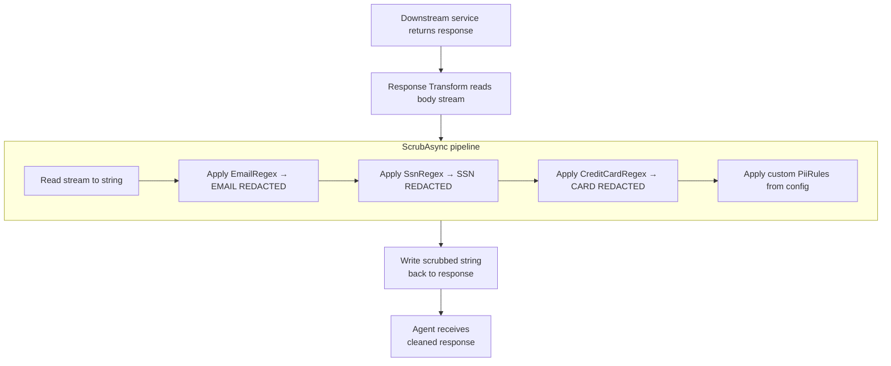

# Feature: Privacy Filter (PII Scrubbing)

## What It Is

A pipeline that runs on every response body before it is returned to an agent. It strips personally identifiable information — emails, SSNs, credit card numbers — replacing matches with redaction placeholders. Additional custom patterns are loaded from configuration, so enterprise customers can add their own PII rules without modifying code.

Runs in the YARP response transform, after the downstream service responds and before the response is written back to the agent.

---

## Flow



---

## Acceptance Criteria

- [ ] Email addresses matching `user@domain.tld` format are replaced with `[EMAIL REDACTED]`
- [ ] SSNs matching `NNN-NN-NNNN` format are replaced with `[SSN REDACTED]`
- [ ] Credit card numbers (13–16 digits, optionally separated by spaces or dashes) are replaced with `[CARD REDACTED]`
- [ ] Content with no PII passes through unchanged
- [ ] Multiple occurrences of PII in a single response are all redacted (not just the first)
- [ ] Custom rules loaded from `appsettings.json` are applied after built-in rules
- [ ] Custom rules support: regex pattern + replacement string
- [ ] A response with no body (e.g., `204 No Content`) passes through without error
- [ ] The filter does not modify `Content-Type`, `Content-Length`, or any response headers except by changing the body length (which it should update)
- [ ] Regex patterns are pre-compiled (`RegexOptions.Compiled`) — not recompiled per request

---

## Files & Functions

```
Ithil.Privacy/
├── PrivacyFilterService.cs
│   └── class PrivacyFilterService : IPrivacyFilter
│       ├── ScrubAsync(Stream responseBody) → Task<string>
│       │   Reads stream → applies built-in patterns → applies custom rules → returns cleaned string
│       │
│       └── private static readonly Regex EmailRegex
│           private static readonly Regex SsnRegex
│           private static readonly Regex CreditCardRegex
│
├── PiiRule.cs
│   └── record PiiRule
│       ├── string Pattern          (regex string)
│       ├── string Replacement      (e.g. "[CUSTOM REDACTED]")
│       └── Apply(string content) → string
│
└── PrivacyFilterOptions.cs
    └── class PrivacyFilterOptions
        └── List<PiiRule> CustomRules   (loaded from appsettings.json)

Ithil.Core/
└── Interfaces/
    └── IPrivacyFilter.cs
        └── ScrubAsync(Stream responseBody) → Task<string>
```

---

## Unit Testing Plan

Tests live in `Ithil.Privacy.Tests/`.

### Test: Scrub_RedactsEmail
- Input: `"Contact us at user@company.com for help"`
- Assert output: `"Contact us at [EMAIL REDACTED] for help"`

### Test: Scrub_RedactsMultipleEmails
- Input contains two different email addresses
- Assert both are redacted

### Test: Scrub_RedactsSsn
- Input: `"SSN: 123-45-6789"`
- Assert output: `"SSN: [SSN REDACTED]"`

### Test: Scrub_RedactsCreditCard_WithSpaces
- Input: `"Card: 4111 1111 1111 1111"`
- Assert output: `"Card: [CARD REDACTED]"`

### Test: Scrub_RedactsCreditCard_WithDashes
- Input: `"Card: 4111-1111-1111-1111"`
- Assert output: `"Card: [CARD REDACTED]"`

### Test: Scrub_RedactsCreditCard_NoSeparator
- Input: `"Card: 4111111111111111"`
- Assert output: `"Card: [CARD REDACTED]"`

### Test: Scrub_PassesThrough_ContentWithNoPii
- Input: `"{ \"quantity\": 42, \"sku\": \"WIDGET-001\" }"`
- Assert output equals input exactly

### Test: Scrub_AppliesCustomRule
- Configure a custom rule: pattern `"ACME-\d{6}"`, replacement `"[ACCOUNT REDACTED]"`
- Input: `"Account: ACME-123456"`
- Assert output: `"Account: [ACCOUNT REDACTED]"`

### Test: Scrub_EmptyStream_ReturnsEmptyString
- Pass an empty `MemoryStream`
- Assert output is `""`

### Test: ScrubAsync_HandlesNullBody_WithoutThrowing
- (If the pipeline can call with a null/empty stream — assert no exception)

### Test: PiiRule_Apply_ReplacesAllMatches
- Rule with pattern `"\d{5}"`, replacement `"[ZIP REDACTED]"`
- Input contains two 5-digit numbers
- Assert both are replaced
