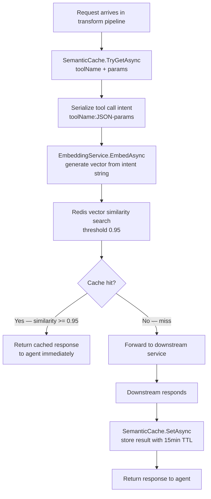

# Feature: Semantic Cache

## What It Is

A Redis-backed cache that keys on **semantic intent** rather than exact request parameters. Two agents asking for the same data using slightly different phrasing (or different parameter ordering) hit the same cache entry.

Uses vector embeddings to represent "what does this tool call mean?" and a similarity threshold to decide if a cached result is close enough to return.

This runs in the request transform pipeline, before forwarding to the downstream service. A cache hit means the downstream service is never called.

---

## Flow



---

## Key Design Decisions

- **Embedding model:** Lightweight local ONNX model (`all-MiniLM-L6-v2`). No data leaves the enterprise's network. No external API call per embedding.
- **Redis Stack required:** Vector similarity search uses RediSearch. Standard Redis does not support this. `docker-compose.yml` uses `redis/redis-stack`.
- **Threshold 0.95:** Tunable via config. Higher = stricter matching (fewer false hits). Lower = more aggressive caching (risk of returning wrong data).
- **Intent string format:** `"{toolName}:{JsonSerializer.Serialize(parameters)}"` — deterministic serialization order matters (parameters sorted alphabetically before serialization).
- **TTL:** 15 minutes default. Some tools (inventory levels) go stale faster. TTL should be configurable per tool via the `[AgentTool]` attribute in a future iteration.

---

## Acceptance Criteria

- [ ] A tool call with identical parameters returns a cached result on the second call
- [ ] A tool call with parameters that differ only in letter case (where semantically equivalent) returns a cache hit
- [ ] A tool call with semantically different parameters returns a cache miss
- [ ] A cache hit short-circuits the request — downstream service is not called
- [ ] `SetAsync` is only called after a successful downstream response (not on error responses)
- [ ] Cache entries expire after 15 minutes by default
- [ ] The similarity threshold is configurable via `appsettings.json`
- [ ] If Redis is unavailable, `TryGetAsync` returns `None` (fail open — treat as miss, not error)
- [ ] If the embedding service is unavailable, `TryGetAsync` returns `None` (fail open)
- [ ] The intent string normalizes parameter order (alphabetical key sort) before embedding

---

## Files & Functions

```
Ithil.Cache/
├── SemanticCacheService.cs
│   └── class SemanticCacheService : ISemanticCache
│       ├── TryGetAsync(string toolName, object parameters) → Task<Option<CacheResult>>
│       │   Builds: intent string
│       │   Calls: IEmbeddingService.EmbedAsync(intent)
│       │   Calls: Redis vector search at threshold from options
│       │   Returns: Some(CacheResult) on hit, None on miss
│       │
│       └── SetAsync(string toolName, object parameters, object response, TimeSpan ttl) → Task
│           Builds: intent string
│           Calls: IEmbeddingService.EmbedAsync(intent)
│           Writes: vector + serialized response to Redis
│
├── IntentSerializer.cs
│   └── static class IntentSerializer
│       └── Serialize(string toolName, object parameters) → string
│           Sorts parameter keys alphabetically before JSON serialization
│           Returns: "{toolName}:{sorted-json}"
│
├── EmbeddingService.cs
│   └── class EmbeddingService : IEmbeddingService
│       └── EmbedAsync(string text) → Task<float[]>
│           Runs: ONNX model inference on input text
│           Returns: embedding vector
│
├── CacheResult.cs
│   └── record CacheResult
│       ├── string SerializedResponse
│       └── float Similarity
│
└── SemanticCacheOptions.cs
    └── class SemanticCacheOptions
        ├── float SimilarityThreshold   (default: 0.95f)
        └── TimeSpan DefaultTtl         (default: 15 minutes)

Ithil.Core/
└── Interfaces/
    ├── ISemanticCache.cs
    │   ├── TryGetAsync(string toolName, object parameters) → Task<Option<CacheResult>>
    │   └── SetAsync(string toolName, object parameters, object response, TimeSpan ttl) → Task
    │
    └── IEmbeddingService.cs
        └── EmbedAsync(string text) → Task<float[]>
```

---

## Unit Testing Plan

Tests live in `Ithil.Cache.Tests/`. The embedding service and Redis are mocked — no actual ONNX inference or Redis in unit tests.

### Test: TryGet_ReturnsCacheResult_WhenSimilarityAboveThreshold
- Mock embedding service returns vector A
- Mock Redis search returns a result with similarity `0.97`
- Threshold configured at `0.95`
- Assert `TryGetAsync` returns `Some(result)`

### Test: TryGet_ReturnsNone_WhenSimilarityBelowThreshold
- Mock Redis search returns result with similarity `0.90`
- Threshold `0.95`
- Assert `TryGetAsync` returns `None`

### Test: TryGet_ReturnsNone_WhenNoResults
- Mock Redis search returns empty list
- Assert `TryGetAsync` returns `None`

### Test: TryGet_ReturnsNone_WhenRedisThrows
- Mock Redis throws
- Assert `TryGetAsync` returns `None` (no exception propagated)

### Test: TryGet_ReturnsNone_WhenEmbeddingServiceThrows
- Mock embedding service throws
- Assert `TryGetAsync` returns `None`

### Test: SetAsync_WritesToRedis_WithCorrectTtl
- Call `SetAsync` with 15-minute TTL
- Assert Redis write was called with a 15-minute expiry

### Test: IntentSerializer_ProducesIdenticalString_ForSameParamsInDifferentOrder
- Input A: `toolName = "GetInventory"`, params `{ productId: 42, warehouseId: "UK-01" }`
- Input B: same but params passed in reverse order (`warehouseId` first)
- Assert `Serialize(A) == Serialize(B)`

### Test: IntentSerializer_ProducesDifferentStrings_ForDifferentTools
- `"GetInventory"` vs `"GetOrders"` with same params
- Assert serialized strings differ

### Test: IntentSerializer_ProducesDifferentStrings_ForDifferentParams
- Same tool, `productId: 42` vs `productId: 99`
- Assert serialized strings differ
