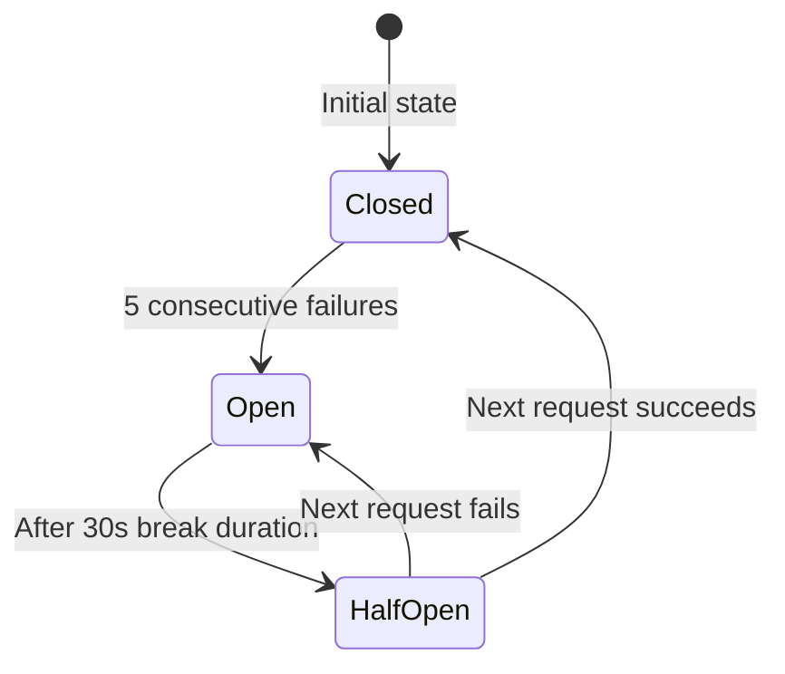
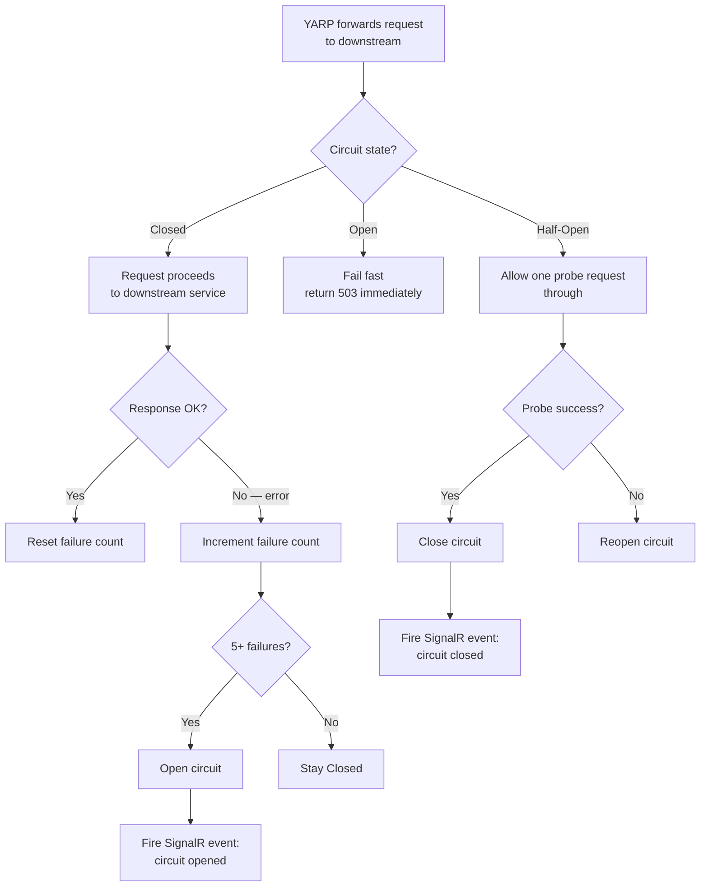

# Feature: Circuit Breaker

## What It Is

A Polly-based circuit breaker on every downstream HTTP client. When a downstream service starts failing repeatedly, the circuit opens and subsequent requests fail fast (without hitting the broken service) until the service recovers.

When a circuit opens or closes, a SignalR trace event fires so the dashboard reflects the live state of every downstream connection.

---

## Circuit States



---

## Flow



---

## Acceptance Criteria

- [ ] Circuit opens after 5 consecutive failures to a downstream service
- [ ] While open, requests fail immediately with `503 Service Unavailable` — downstream is not called
- [ ] Circuit transitions to half-open after 30 seconds
- [ ] A successful probe request in half-open state closes the circuit
- [ ] A failed probe request in half-open state reopens the circuit (another 30s wait)
- [ ] Circuit state is per-downstream route, not global (InventoryService and OrderService have independent circuits)
- [ ] When circuit opens, a SignalR event fires with: `agentId`, `toolName`, `status: "circuit-open"`
- [ ] When circuit closes, a SignalR event fires with: `status: "circuit-closed"`
- [ ] Failure threshold (5) and break duration (30s) are configurable via `appsettings.json`
- [ ] A circuit breaker policy is registered for each named `HttpClient` in the DI container

---

## Files & Functions

```
Ithil.Gateway/
└── Resilience/
    ├── CircuitBreakerPolicyFactory.cs
    │   └── static class CircuitBreakerPolicyFactory
    │       └── Create(CircuitBreakerOptions options, ITraceNotifier notifier, string agentId, string toolName)
    │               → IAsyncPolicy<HttpResponseMessage>
    │           Builds: Polly CircuitBreakerAsync policy
    │           onBreak: calls notifier.NotifyAsync(circuit-open event)
    │           onReset: calls notifier.NotifyAsync(circuit-closed event)
    │
    └── CircuitBreakerOptions.cs
        └── class CircuitBreakerOptions
            ├── int ExceptionsBeforeBreaking    (default: 5)
            └── TimeSpan DurationOfBreak        (default: 30 seconds)

Ithil.Gateway/
└── ServiceCollectionExtensions.cs  (updated)
    └── Registers: named HttpClient "downstream"
        .AddPolicyHandler(CircuitBreakerPolicyFactory.Create(...))

Ithil.Core/
└── Models/
    └── AgentTraceEvent.cs  (updated to include CircuitStatus)
        └── CircuitStatus? CircuitState    ("open" | "closed" | null)
```

---

## Unit Testing Plan

Tests live in `Ithil.Gateway.Tests/Resilience/`. Use Polly's `Policy.WrapAsync` in tests to control the upstream calls.

### Test: CircuitBreaker_RemainsOpen_After5Failures
- Arrange: 5 failed HTTP calls
- Assert: 6th call fails immediately without hitting the downstream (no HTTP call made)

### Test: CircuitBreaker_Closes_AfterSuccessfulProbe
- Open the circuit with 5 failures
- Advance time by 31 seconds (past break duration)
- Make one successful call
- Assert circuit is now closed (next call hits downstream again)

### Test: CircuitBreaker_Reopens_AfterFailedProbe
- Open circuit → wait 31s → probe fails
- Assert circuit is still open (next call fails fast again)

### Test: CircuitBreaker_FiresOpenEvent_WhenCircuitOpens
- Mock `ITraceNotifier`
- Trigger 5 failures
- Assert `ITraceNotifier.NotifyAsync` was called with `CircuitState: "open"`

### Test: CircuitBreaker_FiresClosedEvent_WhenCircuitCloses
- Open circuit → successful probe
- Assert `ITraceNotifier.NotifyAsync` was called with `CircuitState: "closed"`

### Test: CircuitBreaker_IsPerRoute_NotGlobal
- Trigger 5 failures on `InventoryService` route
- Assert `OrderService` route circuit is still closed (passes requests through)

### Test: CircuitBreakerOptions_DefaultValues
- Create `CircuitBreakerOptions` with no overrides
- Assert `ExceptionsBeforeBreaking == 5`
- Assert `DurationOfBreak == TimeSpan.FromSeconds(30)`
