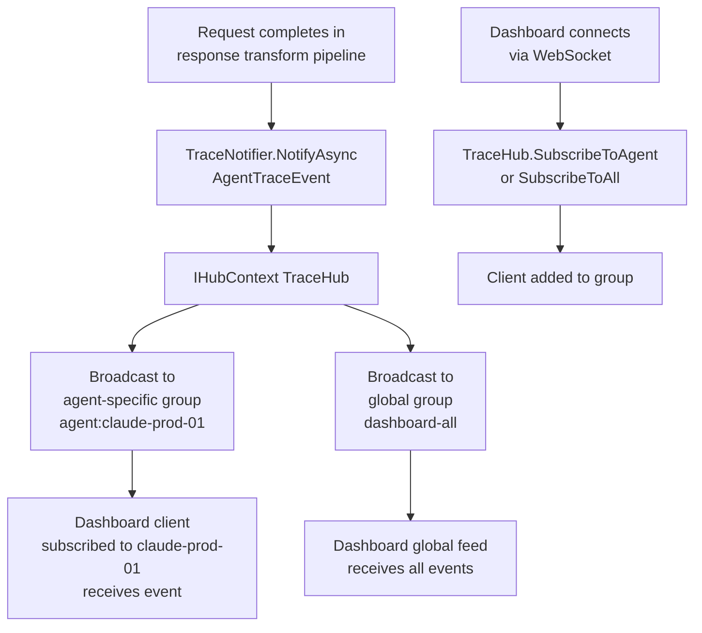
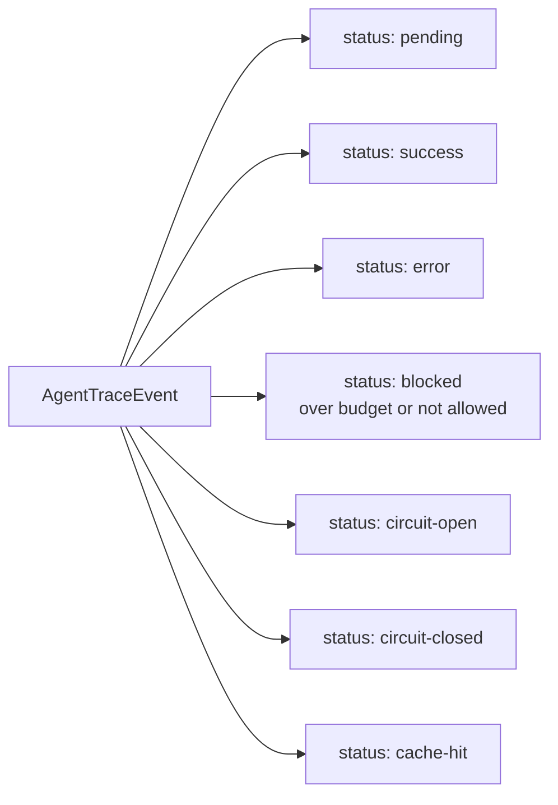

# Feature: SignalR Real-Time Tracing

## What It Is

A SignalR hub that streams live agent activity to the dashboard. Every request that flows through the gateway fires a trace event — the dashboard receives it within milliseconds and updates the live feed without polling.

Clients can subscribe to all agent activity (the global feed) or filter to a specific agent.

---

## Flow



---

## Event Types



---

## Acceptance Criteria

- [ ] A connected dashboard client receives trace events within 500ms of a request completing
- [ ] Subscribing to a specific agent ID delivers only that agent's events
- [ ] The global subscription (`dashboard-all`) receives events from all agents
- [ ] A trace event includes: `traceId`, `agentId`, `toolName`, `status`, `tokensUsed`, `latencyMs`, `timestamp`, optional `errorMessage`
- [ ] `pending` event fires when the request enters the transform pipeline (before forwarding)
- [ ] `success` or `error` event fires after the response transform completes
- [ ] `blocked` event fires when budget check or allowlist check fails
- [ ] `cache-hit` event fires when semantic cache returns a result (downstream never called)
- [ ] `circuit-open` and `circuit-closed` events fire from the circuit breaker
- [ ] The hub does not store events — it is fire-and-forget (history comes from audit log)
- [ ] Azure SignalR Service can replace the in-process hub by changing one config value (scale-out path)

---

## Files & Functions

```
Ithil.Gateway/
└── Hubs/
    ├── TraceHub.cs
    │   └── class TraceHub : Hub
    │       ├── SubscribeToAgent(string agentId) → Task
    │       │   Calls: Groups.AddToGroupAsync(ConnectionId, $"agent:{agentId}")
    │       │
    │       └── SubscribeToAll() → Task
    │           Calls: Groups.AddToGroupAsync(ConnectionId, "dashboard-all")
    │
    └── TraceNotifier.cs
        └── class TraceNotifier : ITraceNotifier
            └── NotifyAsync(AgentTraceEvent traceEvent) → Task
                Calls: _hub.Clients.Group($"agent:{traceEvent.AgentId}").SendAsync("TraceEvent", traceEvent)
                Calls: _hub.Clients.Group("dashboard-all").SendAsync("TraceEvent", traceEvent)

Ithil.Core/
└── Models/
    └── AgentTraceEvent.cs
        └── record AgentTraceEvent
            ├── string TraceId
            ├── string AgentId
            ├── string ToolName
            ├── string Status            ("pending"|"success"|"error"|"blocked"|"cache-hit"|"circuit-open"|"circuit-closed")
            ├── int? TokensUsed
            ├── int? LatencyMs
            ├── string Timestamp         (ISO 8601 UTC)
            ├── string? ErrorMessage
            └── string? CircuitState     ("open"|"closed")
```

---

## Unit Testing Plan

Tests live in `Ithil.Gateway.Tests/Hubs/`. Mock `IHubContext<TraceHub>` — no real SignalR connections in unit tests.

### Test: NotifyAsync_SendsToAgentGroup
- Create event with `AgentId: "claude-prod-01"`
- Call `NotifyAsync(event)`
- Assert `IHubContext.Clients.Group("agent:claude-prod-01").SendAsync("TraceEvent", event)` was called

### Test: NotifyAsync_SendsToGlobalGroup
- Call `NotifyAsync(event)` for any agent
- Assert `IHubContext.Clients.Group("dashboard-all").SendAsync("TraceEvent", event)` was called

### Test: NotifyAsync_SendsToBothGroups_Simultaneously
- Verify both group sends happen in a single `NotifyAsync` call
- Both `SendAsync` calls should be awaited

### Test: TraceHub_SubscribeToAgent_AddsToCorrectGroup
- Mock `IGroupManager`
- Call `SubscribeToAgent("agent-01")`
- Assert `AddToGroupAsync(connectionId, "agent:agent-01")` was called

### Test: TraceHub_SubscribeToAll_AddsToGlobalGroup
- Call `SubscribeToAll()`
- Assert `AddToGroupAsync(connectionId, "dashboard-all")` was called

### Test: AgentTraceEvent_Timestamp_IsUtcIso8601
- Create an `AgentTraceEvent`
- Assert `Timestamp` parses as a valid UTC ISO 8601 datetime

### Test: AgentTraceEvent_StatusValues_AreKnownStrings
- Assert the set of valid status values is constrained (no arbitrary strings)
- (This may be implemented as a discriminated union or enum in practice)
