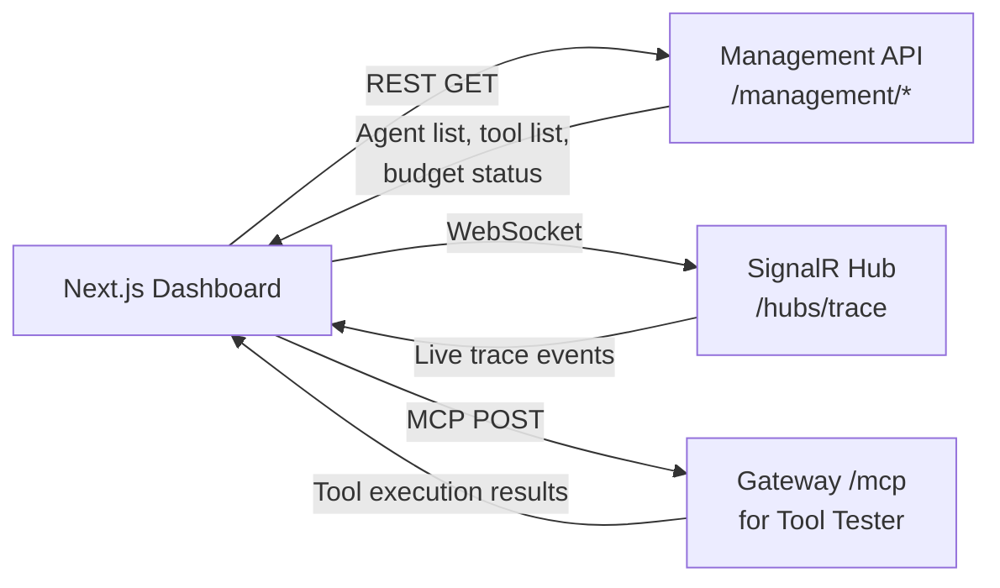

# Feature: Developer Dashboard (Next.js)

## What It Is

A TypeScript / Next.js 15 web application that gives developers visibility and control over the gateway. It shows registered agents, their budgets, the tool library, and a live real-time feed of all agent activity.

The "killer feature" is the Tool Tester: a form-based playground that lets developers call any tool directly through the gateway, see the raw response, and confirm everything is wired up before deploying real agents.

---

## Page Structure

```mermaid
flowchart TD
    A[Dashboard] --> B[/ Overview\nActive agents · request rate · cost today]
    A --> C[/tools Tool Library\nAll discovered MCP tools]
    C --> D[/tools/name Tool Detail\nSchema · telemetry · Tester]
    A --> E[/agents Agent Registry\nCreate · manage identities & budgets]
    E --> F[/agents/id Agent Detail\nBudget gauge · allowed tools · recent traces]
    A --> G[/trace Live Trace Feed\nSignalR real-time stream]
    A --> H[/settings Gateway Config\nPrivacy rules · circuit breaker thresholds]
```

---

## Data Flow



---

## Acceptance Criteria

### General
- [ ] All pages are server-rendered where possible (Next.js App Router, `async` components)
- [ ] Auth-protected pages redirect to login if no session
- [ ] Package manager is `bun`

### Tool Library (`/tools`)
- [ ] Lists all tools from `/.well-known/mcp`
- [ ] Groups tools by `category` if present
- [ ] Shows health status badge per tool (healthy / degraded / offline)
- [ ] Clicking a tool navigates to the detail page

### Tool Detail (`/tools/[name]`)
- [ ] Displays: name, description, required scopes, AllowWrite badge, MaxResponseTokens
- [ ] Displays live telemetry: last used, usage count, avg latency, error rate
- [ ] Tool Tester renders input fields from the tool's JSON Schema
- [ ] Required fields show a `*` marker
- [ ] Tool Tester `Execute` button calls `POST /mcp` with `method: "tools/call"` using `X-Agent-Mode: test-manual`
- [ ] Response is displayed as formatted JSON
- [ ] Execution latency is shown after each test run

### Agent Registry (`/agents`)
- [ ] Lists all agents with: ID, label, budget used/total, active status
- [ ] "New Agent" button opens a form: label, daily token budget, allowed tools (multi-select)
- [ ] Saving creates the agent via `POST /management/agents`
- [ ] Agent API key is shown once after creation and cannot be retrieved again

### Agent Detail (`/agents/[id]`)
- [ ] Budget gauge shows `tokensUsedToday / dailyBudget` as a progress bar
- [ ] Budget gauge updates live via SignalR
- [ ] Table of recent trace events for this agent (last 50)
- [ ] "Revoke Agent" button calls `DELETE /management/agents/{id}` with a confirmation dialog

### Live Trace Feed (`/trace`)
- [ ] Connects to SignalR hub on mount, disconnects on unmount
- [ ] Events appear at the top of the feed (newest first)
- [ ] Feed is capped at 200 visible entries
- [ ] Blocked/error events are visually distinct (red tint)
- [ ] Each event shows: timestamp, agentId, toolName, status, tokensUsed, latencyMs

---

## Files & Functions

```
dashboard/src/
├── types/
│   ├── mcp.ts
│   │   ├── interface McpTool
│   │   ├── interface AgentIdentity
│   │   └── interface AgentTraceEvent
│   │
│   └── management.ts
│       └── interface AgentConfig
│
├── app/
│   ├── page.tsx                       → Overview page
│   ├── tools/
│   │   ├── page.tsx                   → Tool Library
│   │   └── [name]/page.tsx            → Tool Detail
│   ├── agents/
│   │   ├── page.tsx                   → Agent Registry
│   │   └── [id]/page.tsx              → Agent Detail
│   ├── trace/page.tsx                 → Live Trace Feed
│   └── settings/page.tsx              → Gateway Settings
│
├── components/
│   ├── ToolTester.tsx                 → Form + execute button + response display
│   ├── LiveTraceFeed.tsx              → SignalR-connected event list
│   ├── BudgetGauge.tsx                → Progress bar component
│   ├── ToolStatusBadge.tsx            → healthy/degraded/offline badge
│   └── AgentCreateForm.tsx            → New agent form
│
├── lib/
│   ├── signalr.ts                     → createTraceConnection() → HubConnection
│   ├── management-api.ts              → getAgents(), createAgent(), deleteAgent(), getTools()
│   └── mcp-client.ts                  → callTool(toolName, params) → Promise<unknown>
│
└── hooks/
    ├── useTraceEvents.ts              → subscribes to SignalR, returns Seq<AgentTraceEvent>
    └── useBudget.ts                   → polls GetUsageAsync, returns current usage
```

---

## Unit Testing Plan

Tests live in `dashboard/src/__tests__/`. Use Vitest + React Testing Library.

### Test: ToolTester_RendersInputsFromSchema
- Provide a mock `McpTool` with 2 properties in `inputSchema`
- Assert 2 input fields are rendered

### Test: ToolTester_MarksRequiredFields
- Tool has one required and one optional field
- Assert required field has `*` marker, optional does not

### Test: ToolTester_CallsMcpClient_OnExecute
- Mock `callTool`
- Fill in inputs and click Execute
- Assert `callTool` was called with correct tool name and params

### Test: ToolTester_DisplaysResponse_AfterExecution
- Mock `callTool` returns `{ quantity: 42 }`
- Click Execute
- Assert JSON `{ "quantity": 42 }` appears in the output area

### Test: ToolTester_ShowsLatency_AfterExecution
- Assert latency (in ms) is displayed after a successful call

### Test: LiveTraceFeed_RendersEvents
- Provide 3 mock `AgentTraceEvent` items
- Assert all 3 are rendered

### Test: LiveTraceFeed_ShowsRedTint_ForBlockedEvent
- Provide an event with `status: "blocked"`
- Assert the event row has a destructive/red styling

### Test: LiveTraceFeed_ShowsRedTint_ForErrorEvent
- Event with `status: "error"` also gets red/orange styling

### Test: BudgetGauge_ShowsCorrectPercentage
- Props: `used: 25000`, `total: 50000`
- Assert the gauge shows 50%

### Test: BudgetGauge_ShowsRedColor_WhenNearLimit
- Props: `used: 47000`, `total: 50000` (94% used)
- Assert the gauge changes to a warning color
