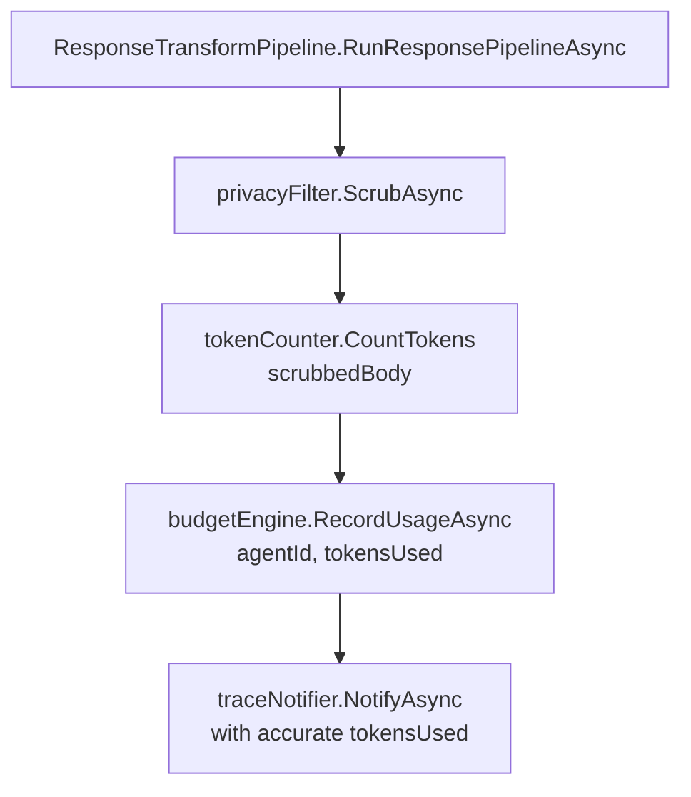

# Feature: Accurate Token Counting

## What It Is

Replaces the whitespace-split token approximation in `ResponseTransformPipeline` with a
real BPE tokenizer. The current implementation (`scrubbedBody.Split(' ').Length`) produces
meaningfully inaccurate counts for JSON payloads, code, and non-English content — exactly
what enterprise API responses look like. Budget figures shown in the dashboard will diverge
from LLM provider billing, and operators will notice.

`Microsoft.ML.Tokenizers` is already in the dependency tree (used by `Ithil.Cache`). This
feature wires it into the gateway response pipeline.

---

## Approach

Introduce an `ITokenCounter` interface in `Ithil.Core` and a `TiktokenTokenCounter`
implementation in `Ithil.Gateway` using `cl100k_base` (OpenAI's tokenizer model, used by
GPT-4 and a reasonable approximation for other LLMs). Inject it into
`ResponseTransformPipeline` as a fourth dependency, replacing the split call.

The tokenizer model file loads once at startup. Counting is synchronous and pure.

**Why an interface rather than a static utility:**
- Keeps `ResponseTransformPipeline` testable without loading a real model file in unit tests
- Consistent with how all other dependencies in this codebase are structured
- Leaves the door open for a model-specific implementation (e.g. if Anthropic publishes a
  standalone Claude tokenizer)

---

## Tokenizer Model Note

`cl100k_base` is accurate for GPT-4 and GPT-3.5. Claude uses its own internal tokenizer
which Anthropic has not published as a standalone library. The count will be close but not
exact for Claude traffic. This must be documented — both in XML doc comments on the
implementation and in a README in the `Tokenization/` folder — so that operators
understand what they are seeing and do not mistake approximation for authoritative billing
figures. The approximation is still dramatically more accurate than splitting on spaces.

---

## Flow



---

## Files and Functions

```
Ithil.Core/
└── Interfaces/
    └── ITokenCounter.cs
        └── interface ITokenCounter
            └── CountTokens(string text) → int
                Pure; no side effects; returns token count for the given text

Ithil.Gateway/
├── Tokenization/
│   ├── README.md                       -- REQUIRED: explains cl100k_base model, its accuracy
│   │                                      for GPT models, known approximation for Claude,
│   │                                      and how to register a custom ITokenCounter
│   └── TiktokenTokenCounter.cs
│       └── class TiktokenTokenCounter : ITokenCounter
│           ├── ctor — loads cl100k_base model once via TiktokenTokenizer.CreateAsync()
│           └── CountTokens(string text) → int
│               Calls: _tokenizer.CountTokens(text)
│               Pure after construction; no external calls
│
└── Transforms/
    └── ResponseTransformPipeline.cs    -- add ITokenCounter parameter; replace Split call

Ithil.Gateway/
└── Program.cs (or DI registration file)
    └── Register TiktokenTokenCounter as singleton ITokenCounter
        Note: singleton because the tokenizer model is loaded once and is thread-safe
```

**Change to `ResponseTransformPipeline`:**

Line 61 changes from:
```csharp
var tokensUsed = scrubbedBody.Split(' ').Length;
```
to:
```csharp
var tokensUsed = tokenCounter.CountTokens(scrubbedBody);
```

---

## Acceptance Criteria

- [ ] `ITokenCounter` interface exists in `Ithil.Core/Interfaces/`
- [ ] `TiktokenTokenCounter` implements `ITokenCounter` using `cl100k_base`
- [ ] `Microsoft.ML.Tokenizers` package reference added to `Ithil.Gateway.csproj`
- [ ] `TiktokenTokenCounter` is registered as a singleton in DI
- [ ] `ResponseTransformPipeline` takes `ITokenCounter` as a constructor parameter
- [ ] The whitespace split on line 61 is removed
- [ ] A `README.md` exists in `Ithil.Gateway/Tokenization/` explaining the model choice,
      its accuracy characteristics, and how to substitute a custom implementation
- [ ] XML doc comment on `TiktokenTokenCounter` states the model used and the known
      approximation behaviour for non-GPT models
- [ ] Existing `ResponseTransformPipeline` tests still pass with a mock `ITokenCounter`

---

## Unit Testing Plan

Tests live in `Ithil.Gateway.Tests/Tokenization/` and `Ithil.Gateway.Tests/Transforms/`.

### TiktokenTokenCounter
- `TiktokenTokenCounter_CountsTokens_ForPlainEnglish` — known English sentence, assert
  count matches expected BPE output (not word count)
- `TiktokenTokenCounter_CountsTokens_ForJsonPayload` — JSON string; assert result differs
  from naive `Split(' ').Length` to confirm the approximation has been replaced
- `TiktokenTokenCounter_CountsTokens_ForCodeSnippet` — code string; same assertion pattern
- `TiktokenTokenCounter_ReturnsZero_ForEmptyString` — empty input returns 0

### ResponseTransformPipeline (updated)
- `ResponseTransformPipeline_UsesTokenCounter_NotWordSplit` — mock `ITokenCounter` returns
  a fixed value; assert `RecordUsageAsync` is called with that exact value, not a word count
- `ResponseTransformPipeline_PassesScrubbedBody_ToTokenCounter` — assert the string passed
  to `CountTokens` is the scrubbed body, not the raw body
