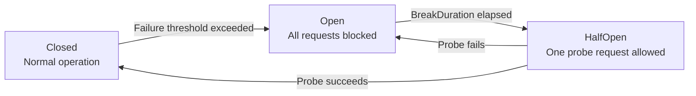

# Feature: Circuit Breaker Half-Open State

## What It Is

Adds the missing third circuit breaker state to the trace event model and the Polly
strategy configuration. Polly has three states: `Closed → Open → HalfOpen → Closed`.
The half-open state is when Polly sends one probe request to test whether the downstream
has recovered. It is the most operationally interesting moment — it is the answer to
"is the downstream actually coming back?"

Currently, `OnHalfOpened` is never wired up, so the state transition is invisible to the
dashboard. Operators watching the trace feed see the circuit open, then see it close again
with no indication of the probe in between.

---

## Polly State Machine



---

## What Changes

Three touch points only:

**1. `AgentTraceEvent.CircuitState` (Ithil.Core)**
The XML doc comment currently lists only `"open"` and `"closed"`. Add `"half-open"` as a
valid value and update the description to explain what it means operationally.

**2. `CircuitBreakerPolicyFactory` (Ithil.Gateway)**
Add an `OnHalfOpened` handler alongside the existing `OnOpened` and `OnClosed` handlers.
Fire a trace event with `Status = "circuit-half-open"` and `CircuitState = "half-open"`.

**3. `CircuitBreakerOptions` (Ithil.Gateway)**
The `BreakDuration` XML doc comment already mentions "half-open state" correctly. No
change needed to the options model itself.

---

## Files and Functions

```
Ithil.Core/
└── Models/
    └── AgentTracingEvent.cs
        └── CircuitState property XML doc
            Update: add "half-open" to the documented valid values

Ithil.Gateway/
└── Resilience/
    └── CircuitBreakerPolicyFactory.cs
        └── CreateStrategyOptions(...)
            Add: OnHalfOpened handler — fires AgentTraceEvent with
                 Status = "circuit-half-open"
                 CircuitState = "half-open"
```

---

## Acceptance Criteria

- [ ] `AgentTraceEvent.CircuitState` XML doc lists all three valid values: `"open"`,
      `"half-open"`, `"closed"`
- [ ] `CircuitBreakerPolicyFactory.CreateStrategyOptions` has an `OnHalfOpened` handler
- [ ] `OnHalfOpened` fires a trace event with `Status = "circuit-half-open"` and
      `CircuitState = "half-open"`
- [ ] The half-open event includes `AgentId`, `ToolName`, and `Timestamp` consistent with
      the open and closed events
- [ ] The dashboard design (`12-Dashboard.md`) already requires HalfOpen to be visually
      distinct — this feature is the data layer that makes that possible

---

## Unit Testing Plan

Tests live in `Ithil.Gateway.Tests/Resilience/`.

### CircuitBreakerPolicyFactory
- `CircuitBreakerPolicyFactory_FiresOpenEvent_OnOpened` — existing test, should already pass
- `CircuitBreakerPolicyFactory_FiresClosedEvent_OnClosed` — existing test, should already pass
- `CircuitBreakerPolicyFactory_FiresHalfOpenEvent_OnHalfOpened` — trigger the half-open
  transition; assert `ITraceNotifier.NotifyAsync` is called with `CircuitState = "half-open"`
  and `Status = "circuit-half-open"`
- `CircuitBreakerPolicyFactory_HalfOpenEvent_IncludesAgentIdAndToolName` — assert the
  half-open trace event carries the correct `AgentId` and `ToolName` passed to the factory
