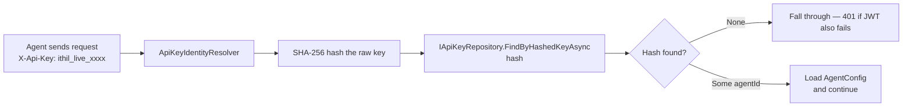

# Feature: API Key Repository

## What It Is

Replaces the `NotImplementedApiKeyRepository` stub with working implementations. Currently,
any agent that authenticates via API key gets a `NotImplementedException` and a 500
response. API key authentication is completely broken.

The interface and hashing logic are already correct — `ApiKeyIdentityResolver` hashes the
raw key with SHA-256 before lookup, and `IApiKeyRepository` is designed around hashed
keys only. This feature is purely about providing real implementations behind that
interface.

---

## How API Key Authentication Works



The plaintext key never touches the repository — only the hash. If someone reads the
Redis store or the database, they cannot reconstruct any agent's key.

---

## Redis Data Model

API keys are stored in a dedicated Redis Hash, separate from agent configs:

```
Key:   ithil:apikeys
Field: {sha256-hex-hash}
Value: {agentId}
```

Lookup is O(1): `HGET ithil:apikeys {hash}` returns the `agentId` directly.

Deletion requires the hash. Since `AgentConfig.ApiKeyHash` (added in feature 15) holds
the hash, the delete flow for agent revocation is:

1. `AgentManagementService` gets the agent's `ApiKeyHash` from `AgentConfig`
2. Calls `IApiKeyRepository.DeleteAsync(apiKeyHash)`
3. Calls `IAgentConfigRepository.DeleteAsync(agentId)`

Both deletions should succeed or both should fail — they are part of the same logical
operation. If Redis is unavailable during revocation, the management API returns an error
rather than partially deleting.

---

## Key Generation Format

Generated keys follow the format: `ithil_live_` + 32 random bytes encoded as lowercase
hex = 75 characters total. The prefix makes keys identifiable (useful when an operator
accidentally commits one to source control — it can be detected and flagged).

Example: `ithil_live_a3f8c2e1b4d9f0e7c6a5b8d2f1e4c7a0b3d6f9e2c5a8b1d4f7e0c3a6b9d2f5`

---

## What Changes

**`IApiKeyRepository`** — add `DeleteAsync`:

```csharp
Task DeleteAsync(string hashedKey);
```

**`NotImplementedStubs.cs`** — remove `NotImplementedApiKeyRepository` once the real
implementations are registered. The stub file entry is deleted, not replaced.

**Same `UseInMemory` flag as feature 15** — when in-memory mode is configured,
`InMemoryApiKeyRepository` is registered. When Redis mode is configured,
`RedisApiKeyRepository` is registered. The flag controls both repositories together.

---

## Files and Functions

```
Ithil.Core/
└── Interfaces/
    └── IApiKeyRepository.cs
        Add: DeleteAsync(string hashedKey) → Task

Ithil.Management/
└── Repositories/
    ├── InMemoryApiKeyRepository.cs
    │   └── class InMemoryApiKeyRepository : IApiKeyRepository
    │       Backed by ConcurrentDictionary<string, string> (hash → agentId)
    │       ├── FindByHashedKeyAsync(string hashedKey) → Task<Option<string>>
    │       ├── CreateAsync(string agentId) → Task<string>
    │       │   Generates: ithil_live_ + 32 random bytes hex
    │       │   Hashes:    SHA-256 of plaintext key
    │       │   Stores:    hash → agentId in dictionary
    │       │   Returns:   plaintext key
    │       └── DeleteAsync(string hashedKey) → Task
    │           Removes hash from dictionary; no-op if not found
    │
    └── RedisApiKeyRepository.cs
        └── class RedisApiKeyRepository : IApiKeyRepository
            Backed by Redis Hash: ithil:apikeys
            ├── FindByHashedKeyAsync(string hashedKey) → Task<Option<string>>
            │   HGET ithil:apikeys {hashedKey} → Some(agentId) or None
            ├── CreateAsync(string agentId) → Task<string>
            │   Generates: ithil_live_ + 32 random bytes hex
            │   Hashes:    SHA-256 of plaintext key
            │   Stores:    HSET ithil:apikeys {hash} {agentId}
            │   Returns:   plaintext key
            └── DeleteAsync(string hashedKey) → Task
                HDEL ithil:apikeys {hashedKey}; no-op if not found

Ithil.Gateway/
├── ServiceCollectionExtensions.cs
│   └── Update registration:
│       if UseInMemory → register InMemoryApiKeyRepository
│       else → register RedisApiKeyRepository
│       Remove: NotImplementedApiKeyRepository registration
│
└── Stubs/NotImplementedStubs.cs
    └── Remove: NotImplementedApiKeyRepository class
```

---

## Coordination With Feature 16 (Management API)

When `AgentManagementService.CreateAsync` creates a new agent:

1. Call `IApiKeyRepository.CreateAsync(agentId)` → get plaintext key
2. Compute SHA-256 hash of the plaintext (same algorithm as `ApiKeyIdentityResolver`)
3. Store the hash on `AgentConfig.ApiKeyHash` via `IAgentConfigRepository.UpsertAsync`
4. Return the plaintext key to the caller (shown once, never again)

The hash is computed twice — once inside `CreateAsync` for the `ithil:apikeys` store, and
once by the management service for `AgentConfig.ApiKeyHash`. Both use identical SHA-256
logic. The hashing algorithm must not diverge between these two places.

To prevent divergence, extract the hashing logic into a single static helper:

```
Ithil.Core/
└── Crypto/
    └── ApiKeyHasher.cs
        └── static class ApiKeyHasher
            └── Hash(string rawKey) → string
                SHA-256 hex lowercase — single source of truth
                Used by: ApiKeyIdentityResolver, InMemoryApiKeyRepository,
                         RedisApiKeyRepository, AgentManagementService
```

---

## Redis Persistence Note

The same persistence requirement from feature 15 applies here. `ithil:apikeys` must
survive process and Redis restarts. If API key hashes are lost, all agents using API
key authentication are locked out until their keys are re-issued. Configure Redis with
RDB or AOF persistence — see `15-AgentConfigPersistence.md` for details.

---

## Acceptance Criteria

- [ ] `IApiKeyRepository` has `DeleteAsync(string hashedKey)`
- [ ] `RedisApiKeyRepository` implements all three methods using `ithil:apikeys` Redis Hash
- [ ] `InMemoryApiKeyRepository` implements all three methods using `ConcurrentDictionary`
- [ ] Both implementations generate keys in `ithil_live_` + 32-byte hex format
- [ ] `FindByHashedKeyAsync` returns `None` for unknown hashes without throwing
- [ ] `DeleteAsync` is a no-op for unknown hashes without throwing
- [ ] `ApiKeyHasher.Hash` is the single SHA-256 implementation used by all callers
- [ ] `NotImplementedApiKeyRepository` is removed from `NotImplementedStubs.cs`
- [ ] `AgentManagementService` uses `ApiKeyHasher.Hash` to compute `ApiKeyHash` for storage on `AgentConfig`
- [ ] An agent created via `POST /management/agents` can authenticate using the returned API key

---

## Unit Testing Plan

Tests live in `Ithil.Management.Tests/Repositories/`.

### RedisApiKeyRepository
- `RedisApiKeyRepository_Create_ReturnsPlaintextKey_WithCorrectPrefix`
- `RedisApiKeyRepository_Create_StoresHash_NotPlaintext` — assert stored value is not
  equal to the returned key
- `RedisApiKeyRepository_FindByHash_ReturnsSome_ForKnownHash`
- `RedisApiKeyRepository_FindByHash_ReturnsNone_ForUnknownHash`
- `RedisApiKeyRepository_Delete_RemovesHash` — create then delete; assert `FindByHash`
  returns `None` afterwards
- `RedisApiKeyRepository_Delete_IsNoOp_ForUnknownHash`

### InMemoryApiKeyRepository
- Same tests as Redis implementation (same interface, same behaviour contracts)

### ApiKeyHasher
- `ApiKeyHasher_ProducesSameHash_ForSameInput`
- `ApiKeyHasher_ProducesDifferentHash_ForDifferentInput`
- `ApiKeyHasher_MatchesApiKeyIdentityResolver_Algorithm` — hash a key with `ApiKeyHasher`
  and with the inline SHA-256 in `ApiKeyIdentityResolver`; assert they are equal
