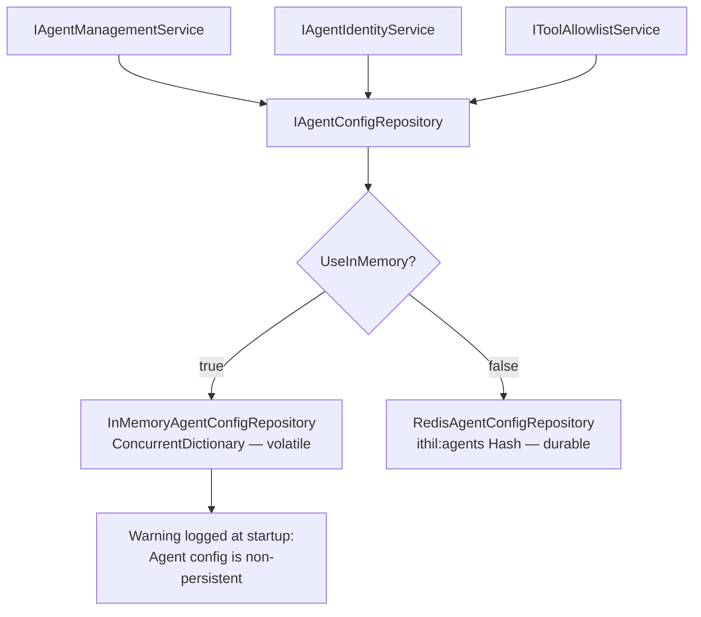

# Feature: Persistent Agent Configuration

## What It Is

Replaces the in-memory `AgentConfigRepository` with a Redis-backed implementation.
Currently, every process restart loses all agent configurations — API keys, budgets, tool
allowlists, everything. The code itself is marked "suitable for development and testing
only." This feature makes the agent registry durable.

Redis is already a required dependency (budget engine, semantic cache). This adds no new
infrastructure — it uses the same connection.

### Redis Persistence — A Critical Requirement

Redis holds data in RAM but writes it to disk via two mechanisms:

- **RDB (snapshots):** Periodic point-in-time dumps to a `.rdb` file. Fast restarts,
  small risk of losing the last interval of writes on a crash.
- **AOF (Append Only File):** Logs every write to disk as it happens. Near-zero data
  loss. Recommended for production.

Both are fundamentally different from the in-memory `ConcurrentDictionary`, which has
no persistence at all — process exit means total data loss.

**This feature requires Redis to be configured with RDB or AOF persistence enabled.**
Without it, Redis itself becomes volatile and agent configs are lost on Redis restart,
defeating the purpose of this feature.

Operators using managed Redis must verify their tier supports persistence:
- **Azure Cache for Redis:** Basic and Standard tiers have no persistence. Premium tier
  is required for RDB/AOF.
- **AWS ElastiCache:** Supports backup/restore but not traditional AOF. Acceptable for
  most use cases.
- **Redis Cloud:** Persistence available on paid tiers.
- **Self-hosted Redis Stack:** Full RDB + AOF support, configurable.

This requirement must be documented in the gateway README and the production deployment
guide.

---

## What Changes

Three things:

**1. `AgentConfig` model — add `ApiKeyHash`**

The management API (feature 16) stores a SHA-256 hash of the agent's API key at creation
time. This hash needs to live on the config record. It is nullable — the dev-seeded agent
and any agent created before feature 16 ships will not have one.

**2. `IAgentConfigRepository` — add missing operations**

The current interface only has `GetAsync` and `UpsertAsync`. The management API needs to
list all agents and delete them. These are missing.

**3. Redis implementation — `RedisAgentConfigRepository`**

A new implementation backed by a Redis Hash. The in-memory implementation is renamed
`InMemoryAgentConfigRepository` and retained for development and testing.

---

## Redis Data Model

All agent configs are stored in a single Redis Hash:

```
Key:   ithil:agents
Field: {agentId}
Value: JSON-serialized AgentConfig
```

This means:
- `HGET ithil:agents {agentId}` — get one agent
- `HSET ithil:agents {agentId} {json}` — upsert one agent
- `HDEL ithil:agents {agentId}` — delete one agent
- `HGETALL ithil:agents` — list all agents

All operations are O(1) except listing (O(n) on number of agents, acceptable — agent
counts are small). All operations are atomic at the Redis level.

---

## Selecting the Implementation

Redis is the default. In-memory is available via configuration for development or
zero-infrastructure setups. Operators who choose in-memory accept that configs are lost
on restart — this must be logged as a warning at startup.

```csharp
// Default — Redis (requires ConnectionStrings:Redis to be configured)
builder.Services.AddIthilGateway(options =>
{
    options.AgentStore.UseInMemory = false; // default
});

// Development / zero-infrastructure
builder.Services.AddIthilGateway(options =>
{
    options.AgentStore.UseInMemory = true;
});
```

`appsettings.Development.json` ships with `UseInMemory: true` so developers without
Redis can run the gateway without extra infrastructure.

---

## Flow



---

## Files and Functions

```
Ithil.Core/
├── Models/
│   └── AgentConfig.cs
│       └── Add: string? ApiKeyHash   -- SHA-256 hash of API key; null if none assigned
│
└── Interfaces/
    └── IAgentConfigRepository.cs
        Add:
        ├── GetAllAsync() → Task<Seq<AgentConfig>>
        └── DeleteAsync(string agentId) → Task<bool>
            Returns true if deleted, false if not found

Ithil.Management/
└── Repositories/
    ├── InMemoryAgentConfigRepository.cs   -- rename of existing AgentConfigRepository
    │   └── Implement new GetAllAsync and DeleteAsync methods
    │       Log warning at construction: agent store is non-persistent
    │
    └── RedisAgentConfigRepository.cs
        └── class RedisAgentConfigRepository : IAgentConfigRepository
            ├── ctor(IConnectionMultiplexer redis)
            ├── GetAsync(string agentId) → Task<Option<AgentConfig>>
            │   HGET ithil:agents {agentId} → deserialize JSON → Some or None
            ├── GetAllAsync() → Task<Seq<AgentConfig>>
            │   HGETALL ithil:agents → deserialize each value → Seq
            ├── UpsertAsync(AgentConfig config) → Task
            │   HSET ithil:agents {agentId} {json}
            └── DeleteAsync(string agentId) → Task<bool>
                HDEL ithil:agents {agentId} → returns 1 if deleted, 0 if not found

Ithil.Gateway/
└── ServiceCollectionExtensions.cs
    └── Update registration:
        if UseInMemory → register InMemoryAgentConfigRepository
        else → register RedisAgentConfigRepository
```

---

## Acceptance Criteria

- [ ] `AgentConfig` has a nullable `ApiKeyHash` property
- [ ] `IAgentConfigRepository` has `GetAllAsync` and `DeleteAsync`
- [ ] `InMemoryAgentConfigRepository` implements all four methods
- [ ] `InMemoryAgentConfigRepository` logs a warning at construction that the store is non-persistent
- [ ] `RedisAgentConfigRepository` implements all four methods using `ithil:agents` Redis Hash
- [ ] `RedisAgentConfigRepository.GetAsync` returns `None` for an unknown agentId without throwing
- [ ] `RedisAgentConfigRepository.DeleteAsync` returns `false` for an unknown agentId without throwing
- [ ] `RedisAgentConfigRepository.UpsertAsync` round-trips `AgentConfig` correctly — all fields survive serialization
- [ ] `AgentConfig.AllowedTools` and `AgentConfig.Scopes` (`Seq<string>`) serialize and deserialize correctly
- [ ] Redis is the default; `appsettings.Development.json` sets `UseInMemory: true`
- [ ] Dev agent seeded in `Program.cs` works with both implementations unchanged

---

## Unit Testing Plan

Tests live in `Ithil.Management.Tests/Repositories/`.

### RedisAgentConfigRepository
- `RedisAgentConfigRepository_Get_ReturnsNone_ForUnknownAgent`
- `RedisAgentConfigRepository_Upsert_ThenGet_RoundTrips_AllFields` — upsert a full
  `AgentConfig` including `AllowedTools`, `Scopes`, and `ApiKeyHash`; assert `GetAsync`
  returns identical values
- `RedisAgentConfigRepository_Upsert_Overwrites_ExistingConfig` — upsert same agentId
  twice with different label; assert second label is returned
- `RedisAgentConfigRepository_GetAll_ReturnsAllUpsertedAgents` — upsert 3 agents;
  assert `GetAllAsync` returns all 3
- `RedisAgentConfigRepository_Delete_ReturnsTrue_WhenAgentExists`
- `RedisAgentConfigRepository_Delete_ReturnsFalse_WhenAgentNotFound`
- `RedisAgentConfigRepository_Delete_RemovesAgent_FromGetAll`

### InMemoryAgentConfigRepository
- `InMemoryAgentConfigRepository_LogsWarning_OnConstruction`
- `InMemoryAgentConfigRepository_GetAll_ReturnsEmpty_WhenNoAgents`
- `InMemoryAgentConfigRepository_Delete_ReturnsFalse_ForUnknownAgent`
