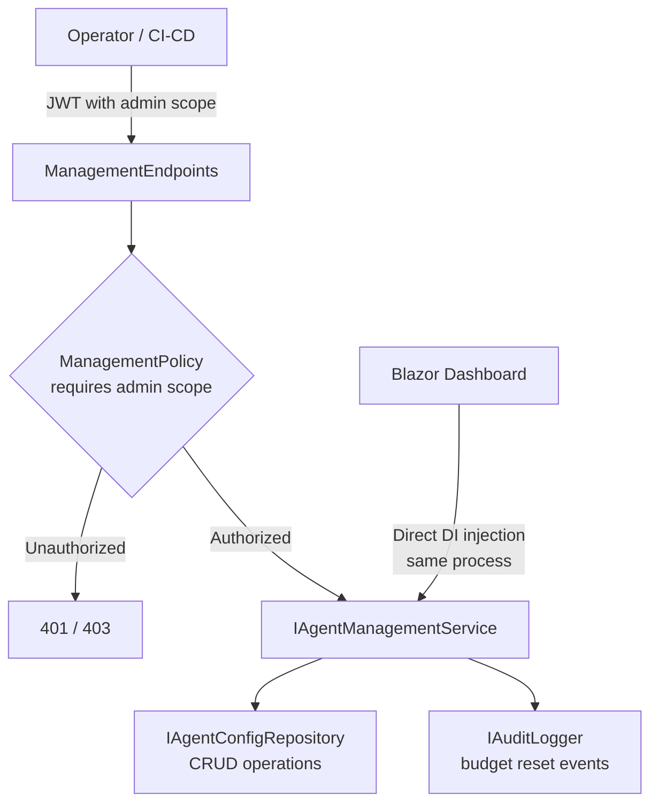

# Feature: Management API

## What It Is

The REST API that operators and automation use to manage the gateway — creating and
revoking agents, configuring budgets and tool allowlists, querying usage, and listing
available tools. Without this, the only way to manage the gateway is editing config
files and restarting the process.

The Blazor dashboard (feature 19) runs in the same process and calls the underlying
service layer directly via DI — it does not go through these HTTP endpoints. The HTTP
endpoints exist for:
- CI/CD pipelines that create agents as part of a deploy
- External admin tooling and scripts
- Future CLI tooling

---

## Authorization

Management endpoints require a JWT with an `admin` scope claim. This reuses the existing
JWT infrastructure — operators get a token with `"scope": "admin"`, agents never receive
that scope. A dedicated `ManagementPolicy` authorization policy enforces this on every
management route.

Agent JWTs and admin JWTs come from the same issuer and are verified with the same
signing key. The scope claim is the only distinction. Operators must not use admin tokens
as agent identities — the gateway rejects admin-scoped tokens on the agent request path.

See `NiceToHave.md` for the future option of a fully separate management JWT issuer.

---

## API Key Security

When an agent is created, the gateway generates a random API key, returns it **once** in
the creation response, and stores only a SHA-256 hash. The plaintext key is never stored
and cannot be retrieved again. If lost, the operator revokes the agent and creates a new
one.

On agent authentication, the presented key is hashed and compared to the stored hash.
This is the same model as GitHub personal access tokens — the system never holds the
secret, only proof of it.

---

## Endpoints

```
POST   /management/agents              Create a new agent
GET    /management/agents              List all agents
GET    /management/agents/{id}         Get a single agent
PUT    /management/agents/{id}         Update agent configuration
DELETE /management/agents/{id}         Revoke and delete an agent

GET    /management/agents/{id}/budget  Get current budget usage
DELETE /management/agents/{id}/budget  Reset budget (audited)

GET    /management/tools               List all discovered MCP tools
```

---

## Request and Response Models

### POST /management/agents

**Request:**
```json
{
  "label": "Finance Agent",
  "dailyTokenBudget": 50000,
  "allowedTools": ["GetInvoice", "ListOrders"],
  "scopes": ["finance.read"]
}
```

**Response (201 Created):**
```json
{
  "agentId": "agt_a1b2c3d4",
  "apiKey": "ithil_live_xxxxxxxxxxxxxxxxxxxx",
  "label": "Finance Agent",
  "dailyTokenBudget": 50000,
  "allowedTools": ["GetInvoice", "ListOrders"],
  "scopes": ["finance.read"],
  "isActive": true
}
```
`apiKey` is shown once and never returned again.

### GET /management/agents/{id}

**Response (200 OK):**
```json
{
  "agentId": "agt_a1b2c3d4",
  "label": "Finance Agent",
  "dailyTokenBudget": 50000,
  "allowedTools": ["GetInvoice", "ListOrders"],
  "scopes": ["finance.read"],
  "isActive": true
}
```
No `apiKey` field.

### PUT /management/agents/{id}

All fields optional — only supplied fields are updated.

**Request:**
```json
{
  "dailyTokenBudget": 75000,
  "isActive": false
}
```

### GET /management/agents/{id}/budget

**Response (200 OK):**
```json
{
  "agentId": "agt_a1b2c3d4",
  "tokensUsedToday": 23400,
  "dailyBudget": 50000,
  "percentageUsed": 46.8,
  "resetsAt": "2026-03-18T00:00:00Z"
}
```

### DELETE /management/agents/{id}/budget

Resets the agent's daily token usage to zero. Produces an audit record. Returns 204 No
Content on success.

### GET /management/tools

Returns all tools discovered by the schema registry at startup.

**Response (200 OK):**
```json
[
  {
    "name": "GetInvoice",
    "description": "Returns invoice details for a given invoice ID",
    "category": "Finance",
    "allowWrite": false,
    "maxResponseTokens": 500,
    "requiredScopes": ["finance.read"]
  }
]
```

---

## Flow



---

## Files and Functions

```
Ithil.Management/
└── Services/
    ├── AgentManagementService.cs
    │   └── class AgentManagementService : IAgentManagementService
    │       ├── GetAllAsync() → Either<ManagementError, Seq<AgentResponse>>
    │       ├── GetAsync(string agentId) → Either<ManagementError, AgentResponse>
    │       ├── CreateAsync(CreateAgentRequest request) → Either<ManagementError, CreateAgentResponse>
    │       │   Generates: agentId (agt_ prefix + random), API key (ithil_live_ prefix + random)
    │       │   Stores: SHA-256 hash of API key, never plaintext
    │       ├── UpdateAsync(string agentId, UpdateAgentRequest request) → Either<ManagementError, AgentResponse>
    │       └── DeleteAsync(string agentId) → Either<ManagementError, Unit>
    │
    └── BudgetQueryService.cs
        └── class BudgetQueryService : IBudgetQueryService
            ├── GetStatusAsync(string agentId) → Either<ManagementError, BudgetStatusResponse>
            └── ResetAsync(string agentId) → Either<ManagementError, Unit>
                Calls: IBudgetEngine.ResetUsageAsync(agentId)
                       Note: if this method does not yet exist on IBudgetEngine,
                       it must be added as part of this feature.
                Calls: IAuditLogger.WriteAsync — outcome: "budget-reset", agentId recorded

Ithil.Management/
└── Models/
    ├── CreateAgentRequest.cs
    ├── CreateAgentResponse.cs      -- includes apiKey (shown once)
    ├── AgentResponse.cs            -- never includes apiKey
    ├── UpdateAgentRequest.cs       -- all fields optional
    ├── BudgetStatusResponse.cs
    └── ManagementError.cs          -- discriminated union: NotFound | Invalid
        Note: Conflict is intentionally absent. AgentIds are always system-generated
        with random bytes — a collision is astronomically unlikely and not a real
        error path worth handling.

Ithil.Gateway/
└── Management/
    ├── ManagementEndpoints.cs
    │   └── static MapManagementEndpoints(this IEndpointRouteBuilder app)
    │       Maps all /management/* routes with ManagementPolicy applied
    │
    └── ManagementAuthPolicy.cs
        └── Registers "ManagementPolicy" — RequireAuthenticatedUser + RequireClaim("scope", "admin")

Ithil.Core/
└── Interfaces/
    ├── IAgentManagementService.cs
    └── IBudgetQueryService.cs
```

---

## AuditRecord — Budget Reset

The existing `AuditRecord` model needs one new `Outcome` value: `"budget-reset"`. The
record for a reset should carry:
- `AgentId` of the agent whose budget was reset
- `OperatorId` of the admin who performed the reset — read from the `sub` claim of the
  admin JWT. Admin JWTs must carry a meaningful `sub` value (e.g. the operator's email
  or a fixed operator identifier). If `sub` is absent, log a warning and record `null`.
- `Outcome = "budget-reset"`
- `Timestamp`

---

## Acceptance Criteria

- [ ] All `/management/*` endpoints require a JWT with `scope: admin` claim
- [ ] Agent JWTs (no admin scope) receive 403 on all management endpoints
- [ ] `POST /management/agents` returns the API key in the response body exactly once
- [ ] The stored API key value is a SHA-256 hash — the plaintext is never persisted
- [ ] `GET /management/agents/{id}` never returns an `apiKey` field
- [ ] `PUT /management/agents/{id}` applies only the fields present in the request body
- [ ] `DELETE /management/agents/{id}` removes the agent and its API key hash
- [ ] `DELETE /management/agents/{id}/budget` resets token usage to zero and writes an audit record
- [ ] `GET /management/agents/{id}/budget` returns correct `percentageUsed` and `resetsAt`
- [ ] `GET /management/tools` returns all tools from the schema registry
- [ ] `ManagementError.NotFound` produces a 404 response
- [ ] `ManagementError.Invalid` produces a 400 response
- [ ] Blazor dashboard services inject `IAgentManagementService` and `IBudgetQueryService` directly — no HTTP calls to these endpoints from within the process
- [ ] Admin tokens are rejected on the agent request path (`/mcp` and YARP routes)

---

## Unit Testing Plan

Tests live in `Ithil.Management.Tests/Services/` and `Ithil.Gateway.Tests/Management/`.

### AgentManagementService
- `AgentManagementService_Create_ReturnsApiKey_OnSuccess` — create agent; assert response contains `apiKey`
- `AgentManagementService_Create_StoresHash_NotPlaintext` — after create, assert stored value differs from the returned key
- `AgentManagementService_Get_ReturnsRight_ForKnownAgent`
- `AgentManagementService_Get_ReturnsNotFound_ForUnknownAgent`
- `AgentManagementService_Update_AppliesOnlySuppliedFields` — update budget only; assert label unchanged
- `AgentManagementService_Delete_ReturnsNotFound_ForUnknownAgent`

### BudgetQueryService
- `BudgetQueryService_GetStatus_ReturnsCorrectPercentage`
- `BudgetQueryService_Reset_CallsBudgetEngine_AndAuditLogger`
- `BudgetQueryService_Reset_ReturnsNotFound_ForUnknownAgent`

### ManagementEndpoints (integration)
- `ManagementEndpoints_Returns403_WhenScopeIsNotAdmin` — JWT with no admin scope
- `ManagementEndpoints_Returns401_WhenNoToken` — no Authorization header
- `ManagementEndpoints_Returns201_OnSuccessfulAgentCreate`
- `ManagementEndpoints_Returns404_OnGetUnknownAgent`
