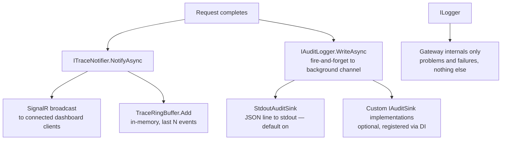
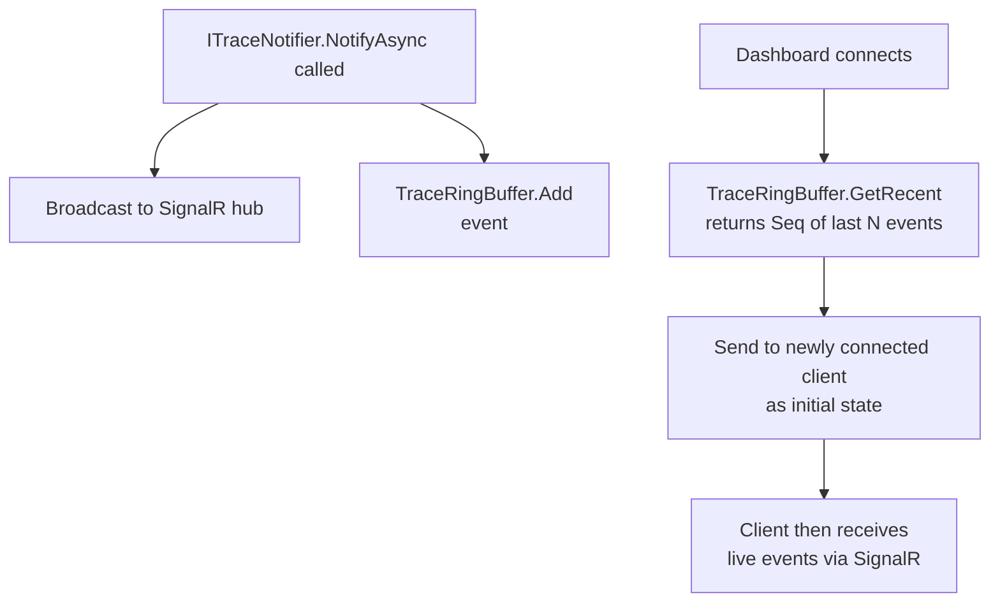

# Feature: Trace Event Retention (Ring Buffer)

## What It Is

Gives the trace feed a short memory. Currently, trace events fire over SignalR and are
immediately gone — a dashboard that connects after the fact arrives to a blank screen,
and a process restart loses everything. This feature adds an in-memory ring buffer that
holds the most recent N events so the dashboard always has something to show on connect.

The buffer is intentionally ephemeral. It is not a database, not a log, and not a
compliance record. Its only job is to answer "what happened in the last few minutes."
The audit log answers everything else.

---

## Why a Ring Buffer and Not Redis

The audit log already handles persistence. Building a second persistent store into the
trace feed would duplicate that responsibility and create two overlapping records of the
same requests with no clear authoritative source.

The trace feed's job is: **what is happening right now.** A ring buffer serves that job
cleanly. Process restart loses the buffer — that is acceptable because the audit log
captured everything durably. Operators who need historical records use the audit log.
Operators watching the live feed use the trace feed.

---

## How a Ring Buffer Works

A ring buffer (also called a circular buffer) is a fixed-size array that overwrites its
oldest entries when full. Think of it as a clock face: a pointer advances around the array
with each new item. When it reaches the end it wraps back to position zero and starts
overwriting. The array never grows and never needs to be compacted.

```
Capacity: 5 slots. After 7 writes:

Step 1-5:  [A][B][C][D][E]   pointer at 0 (full)
Step 6:    [F][B][C][D][E]   pointer at 1 (A overwritten)
Step 7:    [F][G][C][D][E]   pointer at 2 (B overwritten)

Reading the buffer in order always gives the 5 most recent items: C, D, E, F, G
```

This means:
- Memory usage is fixed and known at startup — it never grows under load
- No allocations or GC pressure during normal operation
- Under high agent traffic, old events fall off the back automatically
- The operation is O(1) for both writes and reads

---

## Observability Architecture — How the Pieces Fit Together

> **This README exists because these three systems are easy to confuse. Read this before
> touching any of them.**

Ithil has three distinct observability outputs. They have different jobs and must stay
separate:



### ITraceNotifier → SignalR
**What:** Broadcasts each event in real time to every connected dashboard client.
**When:** Fires for every request that completes through the gateway pipeline.
**Retention:** None. If no client is connected, the event is not stored anywhere by this
channel. The ring buffer (below) provides short-term memory separately.
**Rule:** Never write to `ILogger` for normal events. Only log if the SignalR broadcast
itself fails.

### TraceRingBuffer
**What:** In-memory circular buffer holding the last N trace events (default 500).
**When:** Written to at the same time as the SignalR broadcast.
**Retention:** Ephemeral. Cleared on process restart. Oldest events drop off when full.
**Purpose:** Gives the dashboard something to display on connect without waiting for new
events to arrive.

### IAuditLogger → sinks
**What:** Durable, structured, append-only record of every request.
**When:** Fires for every completed request, including blocked requests and cache hits.
**Retention:** Permanent, determined by the configured sink (stdout → log aggregator
retention policy, file → rolling file config, AppInsights → workspace retention).
**Purpose:** Compliance, forensics, historical queries. Answers "what happened last
Tuesday." The audit log is on by default (StdoutAuditSink). Operators opt out explicitly.

### ILogger
**What:** Standard ASP.NET application logging.
**When:** Only when something that should work is not working — SignalR broadcast failure,
sink write failure, configuration error.
**Purpose:** Gateway health and troubleshooting. Should be quiet during normal operation.

---

## Design Decisions

**Global buffer, not per-agent.**
A single buffer ordered by time is simpler and gives operators a coherent view of all
activity. Per-agent buffers would require knowing agent IDs up front and complicate the
data structure significantly. If filtering by agent is needed, the dashboard filters the
global buffer client-side.

**Default size: 500 events.**
Large enough to give meaningful context on connect. Small enough to be irrelevant for
memory. Configurable via `options.Trace.BufferSize`.

This setting controls both the server-side ring buffer capacity and the maximum number
of events the dashboard displays. There is no separate client-side cap — the dashboard
simply shows whatever the buffer holds. One setting, one place to tune it.

**Thread safety.**
The buffer must be thread-safe. Multiple requests complete concurrently and write to the
buffer simultaneously. Use a lock or `System.Threading.Channels` internally — do not
expose the raw array.

---

## Flow



---

## Files and Functions

```
Ithil.Core/
└── Interfaces/
    └── ITraceBuffer.cs
        └── interface ITraceBuffer
            ├── Add(AgentTraceEvent traceEvent) → Unit
            └── GetRecent(int count) → Seq<AgentTraceEvent>

Ithil.Gateway/
└── Tracing/
    ├── README.md                        -- REQUIRED: full observability architecture
    │                                       explanation (reproduced from this document).
    │                                       Explains trace feed, audit log, ring buffer,
    │                                       ILogger separation, and the rule about not
    │                                       mixing them. Must be kept up to date.
    │
    ├── TraceRingBuffer.cs
    │   └── class TraceRingBuffer : ITraceBuffer
    │       ├── ctor(IOptions<TraceOptions> options)
    │       │   Allocates fixed array of size options.BufferSize
    │       ├── Add(AgentTraceEvent traceEvent) → Unit
    │       │   Thread-safe write; advances pointer; overwrites oldest on wrap
    │       └── GetRecent(int count) → Seq<AgentTraceEvent>
    │           Returns up to count most recent events, newest first
    │
    └── TraceOptions.cs
        └── class TraceOptions
            └── int BufferSize   (default: 500)

Ithil.Gateway/
├── Tracing/
│   └── TraceNotifier.cs                 -- EXISTING FILE: update NotifyAsync to call
│                                           ITraceBuffer.Add(traceEvent) immediately
│                                           after broadcasting via SignalR. Both writes
│                                           happen in NotifyAsync — the ring buffer is
│                                           not a separate code path.
│
└── Hubs/
    └── TraceHub.cs                      -- EXISTING FILE: update OnConnectedAsync to
                                            send ITraceBuffer.GetRecent() to the new client
```

---

## Acceptance Criteria

- [ ] `ITraceBuffer` interface exists in `Ithil.Core/Interfaces/`
- [ ] `TraceRingBuffer` implements `ITraceBuffer` with a fixed-size circular array
- [ ] Buffer size is configurable via `options.Trace.BufferSize`, defaulting to 500
- [ ] `Add` is thread-safe under concurrent writes
- [ ] `GetRecent` returns events newest-first, up to the requested count
- [ ] `GetRecent` returns fewer than `count` items without error when the buffer is not full
- [ ] When the buffer is full, the oldest event is overwritten (not an exception or resize)
- [ ] `TraceHub.OnConnectedAsync` sends the current buffer contents to the newly connected client
- [ ] `ITraceNotifier.NotifyAsync` writes to both the SignalR hub and the ring buffer
- [ ] A `README.md` exists in `Ithil.Gateway/Tracing/` explaining all three observability
      channels, the ring buffer, and the rule separating them — this is a hard requirement

---

## README Configuration Section (Required Content)

The `README.md` in `Ithil.Gateway/Tracing/` must include a configuration reference
covering all three observability channels. Operators and developers should be able to
find every tunable option in one place without reading source code.

The following must be documented:

### Trace Buffer

```csharp
builder.Services.AddIthilGateway(options =>
{
    options.Trace.BufferSize = 1000; // default: 500
});
```

Explains: what the buffer is, why it is capped, what happens when it fills (oldest
events dropped — not an error), and that it is cleared on process restart by design.

### Audit Log

```csharp
// Stdout sink is on by default. To disable:
builder.Services.AddIthilGateway(options =>
{
    options.Audit.DisableStdoutSink = true;
});

// To add a custom sink:
builder.Services.AddSingleton<IAuditSink, MyCustomAuditSink>();
```

Explains: what the audit log is for, that stdout is on by default and why, what JSON
Lines format is and how log aggregators consume it, and how to register additional sinks
without touching `AuditLogger`.

### SignalR Backplane (multi-instance deployments)

```csharp
// Required if running more than one Gateway instance behind a load balancer:
builder.Services.AddSignalR().AddStackExchangeRedis("your-redis-connection-string");
```

Explains: what the backplane problem is, when it applies (any load-balanced deployment),
both solutions (Redis backplane vs sticky sessions), and the tradeoff between them.
Points to `Ithil.Dashboard/Hubs/README.md` for the full backplane discussion.

---

## Unit Testing Plan

Tests live in `Ithil.Gateway.Tests/Tracing/`.

### TraceRingBuffer
- `TraceRingBuffer_StoresAndReturns_WhenBelowCapacity` — add 3 events to a buffer of 5;
  assert `GetRecent(5)` returns all 3
- `TraceRingBuffer_OverwritesOldest_WhenFull` — add 6 events to a buffer of 5; assert
  the first event is no longer present and the 6th is
- `TraceRingBuffer_ReturnsNewestFirst` — add events A, B, C; assert `GetRecent(3)`
  returns C, B, A
- `TraceRingBuffer_RespectsCountParameter` — buffer has 10 events; `GetRecent(3)`
  returns exactly 3
- `TraceRingBuffer_ReturnsEmpty_WhenNoEventsAdded` — fresh buffer; `GetRecent(10)`
  returns empty `Seq`
- `TraceRingBuffer_IsThreadSafe_UnderConcurrentWrites` — 10 threads each write 50
  events concurrently; assert no exception and `GetRecent(500)` returns a valid result

### TraceHub (updated)
- `TraceHub_SendsBufferContents_OnConnect` — mock `ITraceBuffer` returns 3 events;
  assert those events are sent to the connecting client in `OnConnectedAsync`
