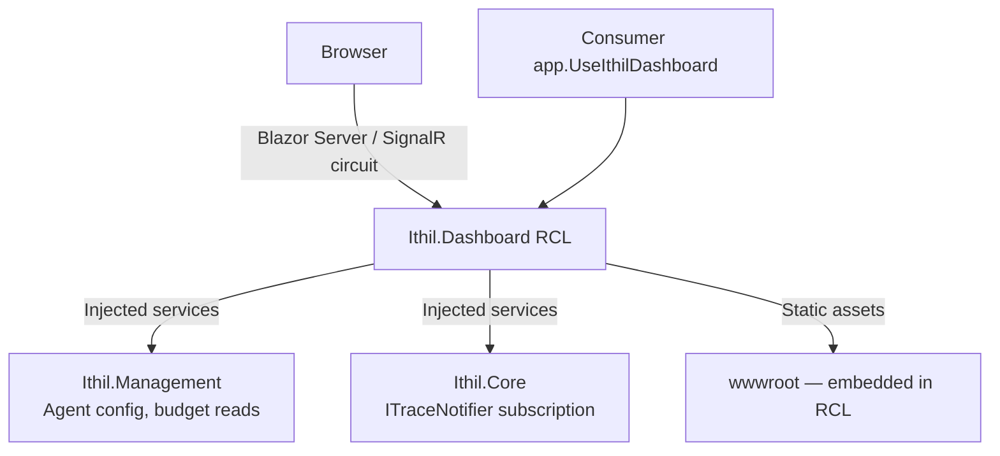

# Feature: Developer Dashboard (Blazor Server)

## What It Is

An operator dashboard embedded directly in the Gateway as a Razor Class Library (RCL).
Consumers opt in by calling `app.UseIthilDashboard()` — no separate container, no Node.js,
no build step. The dashboard is a devops tool for the engineers and operators running the
Gateway, not a public-facing application.

Dashboard v1 scope is the **live operational view**: what is happening right now, which
agents are active, circuit breaker states, and budget burn. Compliance query (paginated
audit log search with filters) is explicitly phase two and out of scope here.

---

## Technology Decisions

| Decision | Choice | Reason |
|---|---|---|
| UI framework | Blazor Server | .NET teams evaluating Ithil should not need Node.js tooling to extend or contribute to the dashboard |
| Component system | MudBlazor | Covers tables, badges, tabs, layout — no custom component primitives needed |
| Charts | None for v1 — raw numbers only | Removing Chart.js eliminates the only JS interop dependency. A latency chart is a nice-to-have; the number in the trace table is sufficient for operators. |
| Delivery | Razor Class Library with embedded static assets | Installs as a NuGet package; consumers call one middleware extension method |
| Auth | Login page issues session cookie after admin JWT validation | See Auth section below |

---

## Auth

Blazor Server uses a persistent WebSocket circuit after the initial HTTP connection.
Standard JWT bearer token auth (Authorization header) does not work for WebSocket frames
— only the initial HTTP handshake can be authenticated via headers.

**v1 approach: login page + session cookie.**

The login page must be a standard Razor Page (`Login.cshtml`), not a Blazor component.
A Blazor component cannot set an HTTP response cookie — it runs inside an already-established
WebSocket circuit and can't modify response headers after the initial handshake.

1. `GET /dashboard/login` — serves a plain HTML form with a single text field for the JWT
2. `POST /dashboard/login` — standard Razor Page POST handler:
   - Validates JWT (admin scope required) using the same JWT validation infrastructure
   - On success: calls `HttpContext.SignInAsync` with a cookie scheme, redirects to `/dashboard`
   - On failure: re-renders the form with an error message
3. All other dashboard routes require the session cookie, enforced via
   `[Authorize(Policy = "DashboardPolicy")]`
4. The Blazor circuit inherits the `ClaimsPrincipal` from the initial authenticated HTTP
   connection — this is standard Blazor Server behavior

**Agent JWTs (no admin scope) must be rejected.** The `DashboardPolicy` requires
`scope: admin`. An agent presenting a valid JWT without admin scope gets a 403 redirect
to the login page.

Cookie authentication must be registered alongside the existing JWT bearer scheme:
```csharp
builder.Services.AddAuthentication()
    .AddCookie("DashboardCookie", options =>
    {
        options.LoginPath = "/dashboard/login";
        options.ExpireTimeSpan = TimeSpan.FromHours(8);
    });
```

```
Ithil.Dashboard/
└── Auth/
    ├── DashboardAuthPolicy.cs    -- registers "DashboardPolicy": RequireAuthenticatedUser
    │                                + RequireClaim("scope", "admin")
    │                                + AuthenticationSchemes = "DashboardCookie"
    └── Login.cshtml / Login.cshtml.cs  -- Razor Page: GET serves form, POST validates
                                           JWT and issues cookie via SignInAsync
```

---

## Functional Programming Boundary

Blazor components are stateful and imperative by nature. The resolution is a strict
boundary: **components are view-only shells.** All filtering, aggregation, state
transitions, and validation live in pure C# service classes returning `Either<DashboardError, T>`
or `Option<T>`. The component calls the service, pattern-matches the result, and renders.

The 75-line file limit applies: split each component into a `.razor` template and a
`.razor.cs` code-behind. If the code-behind is long, the logic belongs in a service.

---

## Architecture



---

## Page Structure

```mermaid
flowchart TD
    A[Dashboard] --> B[/ Overview\nActive agents · request rate · budget burn today]
    A --> C[/trace Live Trace Feed\nReal-time SignalR event stream]
    A --> D[/circuit Circuit Breakers\nState per cluster — closed / open / half-open]
    A --> E[/budget Budget Overview\nPer-agent token burn and daily limits]
    A --> F[/agents Agent Management\nCRUD for agent configuration]
    C --> G[Unidentified Traffic View\nDedicated section for requests with no resolved AgentId]
```

---

## Scaling and Multi-Instance Deployments

Blazor Server holds an open SignalR circuit per connected client. For an internal operator
tool with 5–20 concurrent users this is not a scaling concern. The concern that affects
general web apps (thousands of concurrent users) does not apply here.

The real multi-instance risk is the TraceHub: if two Gateway instances are running behind
a load balancer, a trace event fired on instance A is only broadcast to clients connected
to instance A. Clients on instance B see a partial feed.

Two supported solutions, in order of preference:

**Option 1 — Redis backplane (recommended for production)**
Wire `Microsoft.AspNetCore.SignalR.StackExchangeRedis` into the SignalR configuration.
Every broadcast is published to Redis; all instances subscribe and fan out to their local
clients. StackExchange.Redis is already a Gateway dependency.

**Option 2 — Sticky sessions (simpler, no extra infrastructure)**
Configure the load balancer to pin each client to one Gateway instance for the duration
of their session. Less robust under instance failure but requires no additional config.

> **Required:** A `README.md` must exist in `Ithil.Dashboard/Hubs/` explaining the
> backplane problem, both solutions, and how to configure each. This is a hard requirement
> — any developer who touches the hub code must be able to understand the multi-instance
> behavior without researching it externally.

---

## Unidentified Traffic

Requests where `AgentIdentity` resolution fails arrive with a null or missing `AgentId`.
This must be treated as a first-class event type, not noise. The trace feed must have a
dedicated section or filter for unidentified traffic. A blank cell in the agent column is
not acceptable — operators need to see these events prominently because they may indicate
a misconfigured client, a leaked key being probed, or a scanning attempt.

---

## Project Structure

```
src/
└── Ithil.Dashboard/
    ├── Ithil.Dashboard.csproj          -- Razor Class Library, targets net10.0
    ├── DashboardMiddlewareExtensions   -- app.UseIthilDashboard() entry point
    ├── Hubs/
    │   ├── DashboardHubConnection      -- wraps TraceHub subscription logic
    │   └── README.md                   -- REQUIRED: backplane explanation for future devs
    ├── Pages/
    │   ├── Overview.razor / .razor.cs
    │   ├── TraceFeed.razor / .razor.cs
    │   ├── CircuitBreakers.razor / .razor.cs
    │   ├── BudgetOverview.razor / .razor.cs
    │   └── Agents.razor / .razor.cs
    ├── Auth/
    │   ├── DashboardAuthPolicy.cs      -- "DashboardPolicy": admin scope required
    │   ├── Login.cshtml                -- Razor Page: GET serves form, POST validates JWT
    │   └── Login.cshtml.cs             -- POST handler: SignInAsync → redirect to /dashboard
    ├── Components/
    │   ├── TraceEventRow.razor / .razor.cs
    │   ├── UnidentifiedTrafficRow.razor / .razor.cs
    │   ├── CircuitStateIndicator.razor / .razor.cs
    │   └── BudgetGauge.razor / .razor.cs
    ├── Services/
    │   ├── TraceFeedService.cs         -- pure; filters, aggregates, returns Option/Either
    │   ├── BudgetDashboardService.cs   -- pure; reads budget state, returns Either
    │   ├── CircuitDashboardService.cs  -- pure; maps Polly state to view model
    │   └── AgentDashboardService.cs    -- pure; CRUD against IAgentManagementService
    │       Note: named AgentDashboardService to avoid collision with IAgentManagementService
    └── wwwroot/                        -- embedded static assets
```

---

## Acceptance Criteria

### General
- [ ] Mounted via `app.UseIthilDashboard()` — nothing appears if the call is absent
- [ ] `GET /dashboard/login` serves a plain HTML form (Razor Page, not Blazor)
- [ ] `POST /dashboard/login` with a valid admin JWT issues an `HttpOnly` session cookie and redirects to `/dashboard`
- [ ] `POST /dashboard/login` with an agent JWT (no admin scope) re-renders the form with an error
- [ ] `POST /dashboard/login` with an invalid JWT re-renders the form with an error
- [ ] All dashboard routes (except `/dashboard/login`) require the session cookie with admin scope — unauthenticated requests redirect to `/dashboard/login`
- [ ] Cookie auth scheme is registered in DI alongside the JWT bearer scheme
- [ ] No separate container, Node.js toolchain, or build step required by the consumer
- [ ] `README.md` exists in `Hubs/` explaining the SignalR backplane problem and both configuration options

### Overview (`/`)
- [ ] Shows count of active agents, request rate (last 60s), and total token spend today
- [ ] Data refreshes on a fixed 10s timer

### Live Trace Feed (`/trace`)
- [ ] Connects to TraceHub on page load, disconnects on navigation away
- [ ] Events appear newest-first, up to `options.Trace.BufferSize` events (default 500) — the same setting that controls the server-side ring buffer
- [ ] Blocked and error events are visually distinct from successful events
- [ ] Each event shows: timestamp, agentId (or "Unidentified"), toolName, status, tokensUsed, latencyMs, circuitState
- [ ] Unidentified traffic (null agentId) appears in a dedicated, visually distinct section — not mixed silently into the main feed
- [ ] A filter control allows narrowing the feed by agentId or status

### Circuit Breakers (`/circuit`)
- [ ] Shows one row per monitored cluster
- [ ] Each row displays the current Polly state: Closed, Open, or HalfOpen
- [ ] HalfOpen state is visually distinct and labelled — it is not treated as Open
- [ ] Last state-change timestamp is shown per cluster

### Budget Overview (`/budget`)
- [ ] Lists all agents with: daily budget, tokens used today, percentage consumed
- [ ] Budget gauge shows a warning color when consumption exceeds 80%
- [ ] Values refresh on the same 10s timer as the Overview page — no live SignalR subscription required on this page

### Agent Management (`/agents`)
- [ ] Lists all registered agents with: ID, label, budget, active status
- [ ] New Agent form: label, daily token budget, allowed tools (multi-select)
- [ ] Agent API key is shown once after creation and cannot be retrieved again
- [ ] Revoke Agent button calls delete with a confirmation dialog before acting

---

## Out of Scope (Phase Two)

- Paginated audit log search with date/agent/outcome filters
- Tool library and tool tester (may move here from a separate feature or remain separate)
- Gateway settings management via the dashboard UI

---

## Unit Testing Plan

Tests live in `Ithil.Dashboard.Tests/`.

### TraceFeedService
- `TraceFeedService_FiltersEventsByAgentId` — given 5 events for two agents, filtering by one agentId returns only that agent's events
- `TraceFeedService_IdentifiesUnidentifiedTraffic` — events with null agentId are returned separately from identified traffic
- `TraceFeedService_CapsBufferAtConfiguredSize` — adding events beyond `options.Trace.BufferSize` drops the oldest

### CircuitDashboardService
- `CircuitDashboardService_MapsClosedState` — Polly Closed maps to correct view model value
- `CircuitDashboardService_MapsHalfOpenState` — Polly HalfOpen maps correctly and is not treated as Open

### BudgetDashboardService
- `BudgetDashboardService_ReturnsWarning_WhenThresholdExceeded` — at 81% consumption with 80% threshold, returns warning state
- `BudgetDashboardService_ReturnsSome_ForKnownAgent` — returns `Some` for a registered agent
- `BudgetDashboardService_ReturnsNone_ForUnknownAgent` — returns `None` for an unrecognised agentId

### AgentDashboardService
- `AgentDashboardService_ReturnsRight_OnSuccessfulCreate`
- `AgentDashboardService_ReturnsNone_WhenDeletingUnknownAgent`
