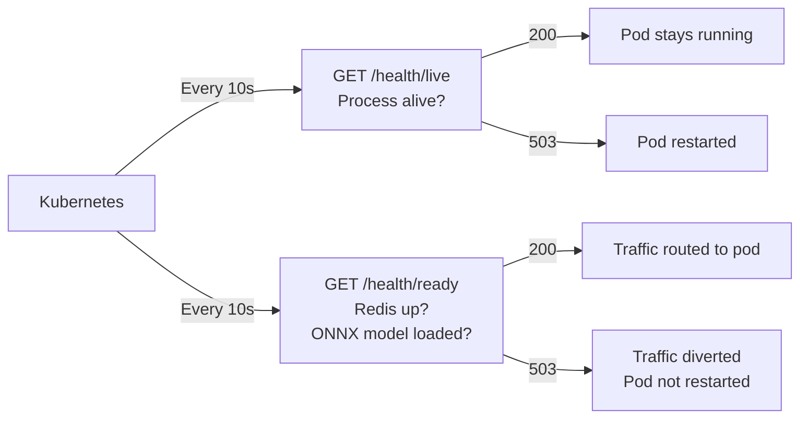

# Feature: Production Readiness

## What It Is

Four gaps that are not feature work but will block enterprise deployment:

1. **Health checks** — the existing `/health` endpoint returns 200 if the process is
   alive. It does not check Redis, the ONNX model, or the downstream. Kubernetes
   readiness probes will route traffic to broken pods.

2. **Graceful shutdown** — no connection draining on SIGTERM. Rolling deployments drop
   in-flight requests.

3. **Redis failure policy** — fail-open is hardcoded. Enterprise security teams need
   a documented, configurable policy.

4. **Configuration reference** — every option is scattered across separate `IOptions<T>`
   classes with no single place for operators to find them.

---

## 1. Health Checks

### Liveness vs Readiness

Kubernetes uses two distinct probes:

- **Liveness** (`/health/live`) — is the process alive and not deadlocked? Returns 200
  unless the process is truly broken. Should never check external dependencies — a Redis
  outage must not restart the pod.

- **Readiness** (`/health/ready`) — is the process ready to receive traffic? Checks
  Redis connectivity and the ONNX embedding model. If this fails, Kubernetes stops
  routing new requests to the pod but does not restart it.



### Checks Required

**Readiness checks (tagged `ready`):**

| Check | What it does | Failure means |
|---|---|---|
| `RedisHealthCheck` | `PING` the Redis connection | Redis unavailable — budget, cache, agent store broken |
| `EmbeddingModelHealthCheck` | Verify ONNX model is loaded | Semantic cache will fail on every request |

**Liveness check:** No custom checks needed. The default ASP.NET liveness check (process
is responding) is sufficient. A failing Redis must not cause a liveness failure.

### Files and Functions

```
Ithil.Gateway/
└── Health/
    ├── RedisHealthCheck.cs
    │   └── class RedisHealthCheck(IConnectionMultiplexer redis) : IHealthCheck
    │       └── CheckHealthAsync(HealthCheckContext, CancellationToken) → HealthCheckResult
    │           Calls: redis.GetDatabase().PingAsync()
    │           Healthy: ping succeeds
    │           Unhealthy: any exception — include exception message in result
    │
    └── EmbeddingModelHealthCheck.cs
        └── class EmbeddingModelHealthCheck(IEmbeddingService embedding) : IHealthCheck
            └── CheckHealthAsync(HealthCheckContext, CancellationToken) → HealthCheckResult
                Calls: embedding.IsReady (bool property added to IEmbeddingService)
                Healthy: model is loaded
                Unhealthy: model not loaded or failed to load

Ithil.Core/
└── Interfaces/
    └── IEmbeddingService.cs
        Add: bool IsReady { get; }

Ithil.Gateway/
└── Program.cs (or ServiceCollectionExtensions.cs)
    Register:
        builder.Services.AddHealthChecks()
            .AddCheck<RedisHealthCheck>("redis", tags: ["ready"])
            .AddCheck<EmbeddingModelHealthCheck>("embedding-model", tags: ["ready"]);

    Map:
        app.MapHealthChecks("/health/live");
        app.MapHealthChecks("/health/ready", new HealthCheckOptions
        {
            Predicate = check => check.Tags.Contains("ready")
        });
```

---

## 2. Graceful Shutdown

### The Problem

Kubernetes sends SIGTERM when terminating a pod during a rolling deployment. The default
.NET behaviour is to stop accepting new requests but not wait for in-flight requests to
complete. Under load, this drops requests at every deploy.

The `AuditBackgroundWorker` also drains a `Channel<AuditRecord>`. Without a shutdown
timeout, the process exits before the channel is drained and audit records are lost.

### The Fix

Configure the host shutdown timeout to give in-flight requests and background workers
time to complete. The timeout must be less than Kubernetes' `terminationGracePeriodSeconds`
(default 30s) to ensure .NET shuts down cleanly before Kubernetes force-kills the pod.

```
Kubernetes terminationGracePeriodSeconds: 30s
.NET shutdown timeout:                    25s  ← leaves 5s buffer
```

Operators deploying to Kubernetes must set `terminationGracePeriodSeconds` in their pod
spec. This must be documented in the deployment guide.

### Files and Functions

```
Ithil.Gateway/
└── Program.cs
    Add host options configuration:
        builder.Services.Configure<HostOptions>(options =>
        {
            options.ShutdownTimeout = TimeSpan.FromSeconds(25);
        });

    Note: ShutdownTimeout is configurable via options.Shutdown.TimeoutSeconds
          so operators can adjust it to match their Kubernetes grace period.
```

```
Ithil.Gateway/
└── Options/
    └── ShutdownOptions.cs
        └── class ShutdownOptions
            └── int TimeoutSeconds   (default: 25)
```

The `AuditBackgroundWorker` already receives a `CancellationToken` via `BackgroundService`.
Verify it respects cancellation — it must stop reading from the channel and flush
remaining records within the shutdown window.

---

## 3. Redis Failure Policy

### The Problem

Both `BudgetEngine` and `SemanticCacheService` currently fail open — if Redis is
unavailable, budget checks return "within budget" and all agents can spend unlimited
tokens. This is hardcoded with no configuration option.

Enterprise security teams will ask: "what happens to governance if your Redis goes down?"
The current answer — "all governance is silently bypassed" — will fail security reviews.

### The Options

| Policy | Behaviour | When to use |
|---|---|---|
| `FailOpen` | Requests pass through; budget not enforced; cache always misses | When availability is more important than governance |
| `FailClosed` | All requests rejected with 503 until Redis recovers | When governance must never be bypassed |

Neither is universally correct. This must be a documented, configurable choice that
operators make explicitly.

### Configuration

```csharp
builder.Services.AddIthilGateway(options =>
{
    options.Redis.FailurePolicy = RedisFailurePolicy.FailOpen;   // default
    // or
    options.Redis.FailurePolicy = RedisFailurePolicy.FailClosed;
});
```

### Files and Functions

```
Ithil.Gateway/
└── Options/
    └── RedisOptions.cs
        └── class RedisOptions
            └── RedisFailurePolicy FailurePolicy   (default: FailOpen)

Ithil.Core/
└── Enums/
    └── RedisFailurePolicy.cs
        └── enum RedisFailurePolicy
            ├── FailOpen    -- governance bypassed on Redis failure
            └── FailClosed  -- all requests rejected on Redis failure

Ithil.Budget/
└── BudgetEngine.cs
    Update: IsWithinBudgetAsync — check RedisOptions.FailurePolicy
    If FailClosed and Redis unavailable → return false (reject request)
    If FailOpen and Redis unavailable → return true (pass through, log warning)

Ithil.Cache/
└── SemanticCacheService.cs
    Update: TryGetAsync — FailClosed behaviour means throwing to the pipeline
    rather than returning None. The pipeline catches this and returns 503.
    (Cache write failures remain non-fatal under both policies — a failed write
    is never a reason to reject a request.)
```

### Startup Warning

If `FailurePolicy` is `FailOpen`, log a warning at startup:

```
[IthilGateway] Redis failure policy is FailOpen. Budget enforcement and semantic
caching will be bypassed if Redis becomes unavailable. Set options.Redis.FailurePolicy
= FailClosed to reject requests instead.
```

This is the one case where a startup log is warranted — it is surfacing a security policy
decision the operator may not have made consciously.

---

## 4. Configuration Reference

A `docs/CONFIGURATION.md` file at the repository root listing every configurable option
in one place. Operators must not need to read source code to deploy the gateway.

### Required Content

The document must cover every `IOptions<T>` class and every top-level option, grouped
by concern:

| Section | Options covered |
|---|---|
| JWT Authentication | `Ithil:Jwt:SigningKey`, `Issuer`, `Audience` |
| Agent Store | `UseInMemory`, Redis persistence requirement |
| Budget Engine | `DefaultDailyTokenLimit` |
| Semantic Cache | `SimilarityThreshold`, `DefaultTtl`, `ModelPath`, `VocabPath` |
| Circuit Breaker | `MinimumThroughput`, `FailureRatio`, `SamplingDuration`, `BreakDuration` |
| Tool Registry | `DownstreamBaseUrl`, `SchemaPath` |
| Privacy Filter | `CustomRules` |
| Redis | `ConnectionStrings:Redis`, `FailurePolicy` |
| Audit Log | `DisableStdoutSink` |
| Trace Buffer | `BufferSize` |
| Shutdown | `TimeoutSeconds` |
| Dashboard | `UseIthilDashboard()` opt-in |

For each option, the document must include: the config key, the type, the default value,
whether it is required or optional, and a one-line description of what it does.

### Files

```
docs/
└── CONFIGURATION.md     -- generated/maintained by hand; updated whenever a new
                            IOptions<T> class is added to any project
```

A note in `CLAUDE.md` (or a developer README) must state: **any time a new configuration
option is added, `docs/CONFIGURATION.md` must be updated in the same PR.**

---

## Acceptance Criteria

### Health Checks
- [ ] `GET /health/live` returns 200 when the process is running, regardless of Redis state
- [ ] `GET /health/ready` returns 200 only when Redis is reachable and the ONNX model is loaded
- [ ] `GET /health/ready` returns 503 when Redis is unavailable
- [ ] `GET /health/ready` returns 503 when the embedding model failed to load
- [ ] `IEmbeddingService` has an `IsReady` property
- [ ] Kubernetes liveness probe can be pointed at `/health/live`
- [ ] Kubernetes readiness probe can be pointed at `/health/ready`

### Graceful Shutdown
- [ ] Shutdown timeout is configurable via `options.Shutdown.TimeoutSeconds` (default: 25)
- [ ] In-flight requests complete before the process exits within the shutdown window
- [ ] `AuditBackgroundWorker` respects the cancellation token and flushes remaining records
- [ ] Deployment guide documents the relationship between `.NET ShutdownTimeout` and
      Kubernetes `terminationGracePeriodSeconds`

### Redis Failure Policy
- [ ] `RedisFailurePolicy` enum exists with `FailOpen` and `FailClosed` values
- [ ] Default is `FailOpen` — existing behaviour unchanged
- [ ] `FailClosed` causes `BudgetEngine.IsWithinBudgetAsync` to return `false` when Redis is unavailable
- [ ] `FailClosed` causes `SemanticCacheService.TryGetAsync` to propagate the failure rather than return `None`
- [ ] A startup warning is logged when `FailOpen` is configured
- [ ] Cache write failures are non-fatal under both policies

### Configuration Reference
- [ ] `docs/CONFIGURATION.md` exists and covers every option listed in the table above
- [ ] Each entry has: config key, type, default, required/optional, description
- [ ] A rule is added to `CLAUDE.md` requiring this file to be updated when new options are added

---

## Unit Testing Plan

Tests live in `Ithil.Gateway.Tests/Health/`, `Ithil.Budget.Tests/`, `Ithil.Cache.Tests/`.

### RedisHealthCheck
- `RedisHealthCheck_ReturnsHealthy_WhenPingSucceeds`
- `RedisHealthCheck_ReturnsUnhealthy_WhenRedisThrows`

### EmbeddingModelHealthCheck
- `EmbeddingModelHealthCheck_ReturnsHealthy_WhenModelIsReady`
- `EmbeddingModelHealthCheck_ReturnsUnhealthy_WhenModelNotReady`

### BudgetEngine (FailClosed)
- `BudgetEngine_ReturnsFalse_WhenRedisUnavailable_AndFailClosed`
- `BudgetEngine_ReturnsTrue_WhenRedisUnavailable_AndFailOpen`

### SemanticCacheService (FailClosed)
- `SemanticCacheService_PropagatesException_WhenRedisUnavailable_AndFailClosed`
- `SemanticCacheService_ReturnsNone_WhenRedisUnavailable_AndFailOpen`
