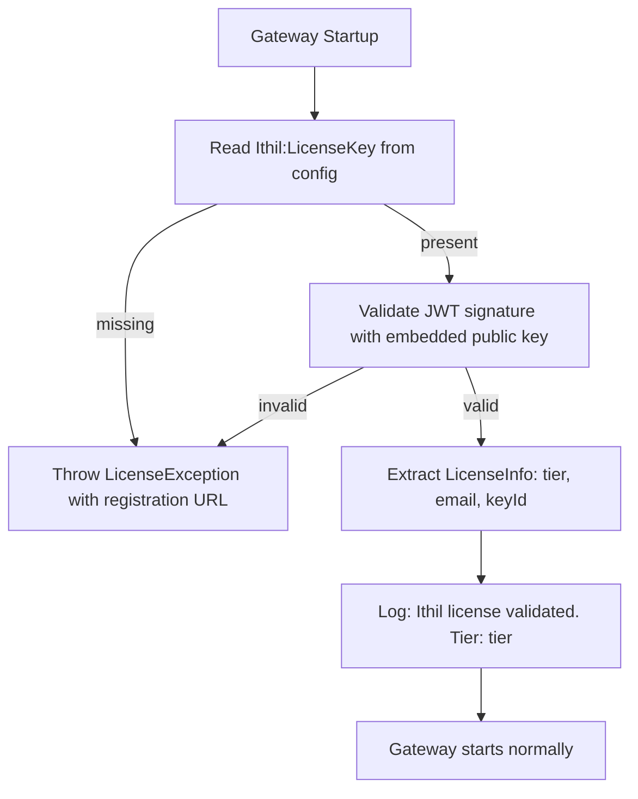

# Feature: License Key System — Ithil Gateway (.NET)

## What It Is

Startup-time license validation baked into the Ithil gateway. The gateway reads a JWT license key from `appsettings.json`, validates its RS256 signature against a public key embedded in the binary, and either starts normally or throws a clear exception. No network call, no phone home.

---

## Architecture



---

## Files to Build

All files live under `src/Ithil.Core/Licensing/`.

### `LicenseInfo.cs`
A simple record holding the validated claims extracted from the JWT.

```csharp
public record LicenseInfo(string Tier, string Email, string KeyId);
```

### `LicenseException.cs`
Thrown at startup when a key is missing or invalid. Inherits `Exception`.

Message for missing key:
```
No Ithil license key found. Register for free at ithil.software/register.
Add your key to appsettings.json under Ithil:LicenseKey.
```

Message for invalid key:
```
The Ithil license key is invalid or has been tampered with.
Register at ithil.software/register to get a new key.
```

### `LicenseValidator.cs`
The core validation logic.

- Reads `IConfiguration["Ithil:LicenseKey"]`
- If missing or empty: throws `LicenseException` (missing message)
- Validates JWT signature using the embedded RS256 public key
- If invalid: throws `LicenseException` (invalid message)
- Returns `LicenseInfo` with `Tier`, `Email`, and `KeyId` (the `jti` claim)

### Public key embedding
- Store the RS256 public key as an embedded resource in `Ithil.Core`
- Load via `Assembly.GetManifestResourceStream` — not from disk, not from config
- This ensures the key is baked into the binary and can't be swapped out

### Gateway bootstrap wiring (`Program.cs` or equivalent)
- Call `LicenseValidator.Validate()` early in startup, before any middleware is registered
- Log tier on success at `Information` level: `"Ithil license validated. Tier: {Tier}"`
- Let `LicenseException` bubble — application must not start without a valid key

---

## appsettings.json shape (user-facing)

```json
{
  "Ithil": {
    "LicenseKey": "eyJhbGciOiJSUzI1NiJ9..."
  }
}
```

---

## Dependencies

| Package | Purpose |
|---|---|
| `System.IdentityModel.Tokens.Jwt` | JWT parsing and RS256 signature validation |
| `Microsoft.IdentityModel.Tokens` | `RsaSecurityKey`, `TokenValidationParameters` |

---

## Acceptance Criteria

- [ ] Gateway starts normally with a valid non-commercial key
- [ ] Gateway starts normally with a valid commercial key
- [ ] Gateway throws `LicenseException` and exits with a clear message if key is missing from config
- [ ] Gateway throws `LicenseException` and exits with a clear message if key signature is invalid
- [ ] Gateway throws `LicenseException` and exits with a clear message if key payload is tampered
- [ ] Gateway logs tier at `Information` level on successful validation
- [ ] Public key is loaded from embedded resource, not from disk or config
- [ ] `LicenseException` message includes the registration URL

---

## Unit Test Plan

**`LicenseValidatorTests`**

| Test | Expected |
|---|---|
| Valid non-commercial JWT | Returns `LicenseInfo` with `Tier = "non-commercial"` |
| Valid commercial JWT | Returns `LicenseInfo` with `Tier = "commercial"` |
| Missing key in config | Throws `LicenseException` with message containing `ithil.software` |
| Empty string in config | Throws `LicenseException` |
| JWT signed with wrong private key | Throws `LicenseException` |
| JWT with tampered payload (re-encoded without signing) | Throws `LicenseException` |
| JWT missing `tier` claim | Throws `LicenseException` |
| JWT missing `sub` claim | Throws `LicenseException` |

---

## Notes

- Key revocation has inherent lag since validation is local. This is a deliberate tradeoff — phoning home conflicts with the product's self-hosted, privacy-first positioning.
- The `jti` claim in the JWT enables future opt-in revocation checking if that tradeoff is ever revisited.
- Test key generation (for unit tests) requires a separate RSA key pair — never use the production private key in tests.
