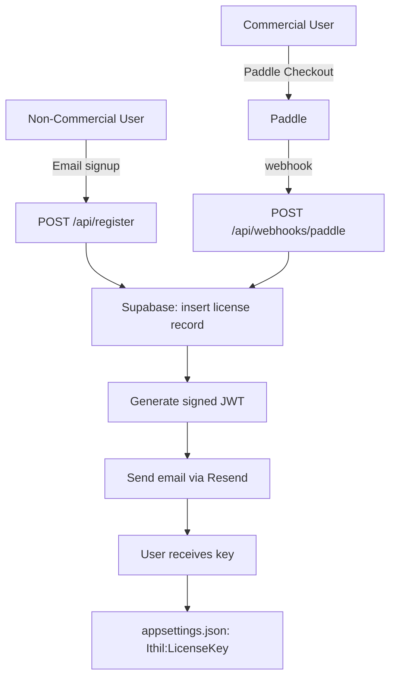

# Feature: License Key System — ithil.software (Web)

## Status

Core implementation is complete. Remaining items are tied to the future Paddle integration.

---

## What It Does

The web side generates, stores, and delivers signed JWT license keys. Non-commercial users register with an email address and receive a key immediately. Commercial users will complete a Paddle checkout, with key delivery triggered by a webhook.

---

## Architecture



---

## Key Format

License keys are signed JWTs using RS256. The private key lives in Vercel environment variables and never leaves the backend. The corresponding public key is baked into the Ithil gateway binary.

**JWT payload:**
```json
{
  "sub": "user@example.com",
  "tier": "non-commercial | commercial",
  "iat": 1700000000,
  "jti": "uuid-v4-key-id"
}
```

Keys do not expire by design. Revocation is handled by setting `revoked_at` in Supabase — since gateway validation is local (no phone home), revocation takes effect only on next key re-issue. This is a deliberate tradeoff for a self-hosted product.

---

## Supabase Schema

```sql
create table licenses (
  id                      uuid primary key default gen_random_uuid(),
  email                   text not null,
  tier                    text not null check (tier in ('non-commercial', 'commercial')),
  license_key             text not null unique,   -- full JWT, stored for resend
  paddle_customer_id      text,                   -- null for non-commercial
  paddle_subscription_id  text,                   -- null for non-commercial
  created_at              timestamptz default now(),
  revoked_at              timestamptz             -- null = active
);

create unique index licenses_email_tier_idx on licenses (email, tier);
```

---

## What Is Already Built

### `/api/register` (POST)
- Validates email format → 400 if invalid
- Checks Supabase for existing non-commercial record → resends existing key if found
- Generates signed JWT via `jose`
- Inserts `licenses` row with `tier: 'non-commercial'`
- Sends key email via Resend
- Returns `{ ok: true }` — never reveals whether the email already existed

### `/api/checkout` (POST) — Stripe, to be replaced with Paddle
- Creates a checkout session
- Returns client secret for embedded Stripe UI

### `/api/webhook` (POST) — Stripe, to be replaced with Paddle
- Verifies webhook signature
- Handles `checkout.session.completed` → inserts commercial license record, generates key, sends email

### Email delivery (`src/lib/email.ts`)
- Two email variants: non-commercial and commercial
- Contains the license key and `appsettings.json` instructions

### Frontend
- `Register.tsx` — email form, calls `/api/register`, shows inline success state
- `Pricing.tsx` — pricing display
- `CheckoutModal.tsx` — embedded Stripe checkout (to be replaced with Paddle)

---

## Remaining Work (Paddle Integration — Future)

When Paddle is integrated, the Stripe-specific routes need to be replaced:

### `/api/webhooks/paddle` (POST)
- Verify Paddle webhook signature
- Handle `subscription.activated` → insert commercial license record, generate key, send email
- Handle `subscription.updated` where `status = 'past_due'` or period has ended → set `revoked_at`
- Handle subscription period-end (not immediate cancellation) → revoke key when paid period expires

> **Revocation timing**: When a user cancels, they retain access until the period they paid for ends. Revoke on period-end, not on cancellation.

### `/api/create-checkout-session` (POST)
- Replace Stripe session creation with Paddle checkout URL generation

---

## What Was Deliberately Dropped

- **Rate limiting** (`@upstash/ratelimit`) — low priority for an indie tool; can add if abuse becomes a problem
- **`/register/success` page** — not needed; the email contains the key directly, no landing page required
- **Key revocation self-service** — out of scope for v1; manual support via email

---

## Environment Variables (Vercel)

```
LICENSE_PRIVATE_KEY          # RS256 private key, base64-encoded
NEXT_PUBLIC_SUPABASE_URL
SUPABASE_SECRET_KEY          # service role, server-side only
RESEND_API_KEY
# Stripe vars — remove when Paddle integration is complete
STRIPE_SECRET_KEY
STRIPE_WEBHOOK_SECRET
STRIPE_PRICE_ID
NEXT_PUBLIC_STRIPE_PUBLISHABLE_KEY
```

---

## Acceptance Criteria

### Non-commercial signup
- [x] Email form submits to `POST /api/register` and shows confirmation
- [x] Valid email → Supabase record created, key email sent
- [x] Duplicate email → no new record, existing key resent
- [x] Invalid email format → 400

### Commercial flow (Paddle — future)
- [ ] Paddle checkout session created and user redirected
- [ ] `subscription.activated` webhook creates Supabase record and sends key email
- [ ] Cancellation webhook sets `revoked_at` only after paid period ends
- [ ] Webhook signature verification rejects tampered requests

### Security
- [x] Private key never appears in client-side code or git history
- [x] Supabase service role key never exposed to browser
- [x] Webhook signature validated on every request
