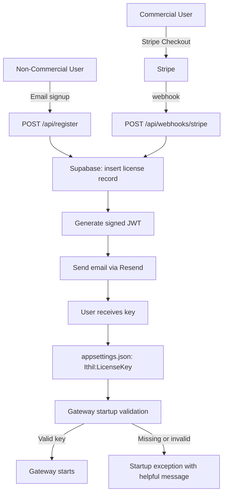

# Feature: License Key System

## What It Is

The end-to-end licensing infrastructure for Ithil. Every user — free or paid — receives a signed JWT license key. Non-commercial users register with an email address only. Commercial users complete a Stripe checkout. Both receive their key via email and drop it into `appsettings.json`. The gateway validates the key locally at startup using a public key baked into the binary — no phone home, no internet dependency.

This feature spans two codebases:
- **ithil.software** (Next.js 15 on Vercel) — signup flow, Stripe webhook, key generation, email delivery
- **Ithil gateway** (.NET) — key validation at startup

---

## Architecture



---

## Key Format

License keys are signed JWTs. The private key is held server-side in Vercel environment variables and never leaves the ithil.software backend. The corresponding public key is baked into the Ithil gateway binary at build time.

**JWT payload:**
```json
{
  "sub": "user@example.com",
  "tier": "non-commercial | commercial",
  "iat": 1700000000,
  "jti": "uuid-v4-key-id"
}
```

Keys do not expire by design. Revocation is handled by setting `revoked_at` in Supabase — since validation is local, revocation takes effect only on key re-issue. This is an acceptable tradeoff for a self-hosted product.

---

## Supabase Schema

```sql
create table licenses (
  id           uuid primary key default gen_random_uuid(),
  email        text not null,
  tier         text not null check (tier in ('non-commercial', 'commercial')),
  key_jti      text not null unique,       -- JWT ID, used for revocation lookup
  stripe_customer_id      text,            -- null for non-commercial
  stripe_subscription_id  text,            -- null for non-commercial
  created_at   timestamptz default now(),
  revoked_at   timestamptz                 -- null = active
);
```

---

## ithil.software: Files to Build

### Pages (Next.js App Router)

**`/app/register/page.tsx`**
- Email input form for non-commercial signup
- On submit: POST to `/api/register`
- On success: shows confirmation message ("Check your email")
- On error (400): shows inline validation error

**`/app/register/success/page.tsx`**
- Static confirmation page linked from the registration email
- Instructions for adding the key to `appsettings.json`
- No dynamic content; no auth required

**`/app/pricing/page.tsx`** (or equivalent)
- Displays commercial tier details and a "Buy" button
- On click: POST to `/api/create-checkout-session` → redirect to Stripe Checkout URL

### API Routes (Next.js App Router)

**`/app/api/register/route.ts`**
- Accepts `POST { email: string }`
- Validates email format — returns `400` if invalid
- **Rate limited:** maximum 5 requests per IP per hour via Vercel Edge middleware or
  `@upstash/ratelimit`. Without this, the endpoint can be used to enumerate existing
  emails and exhaust the Resend API quota.
- Checks Supabase for existing record — resend key if already registered
- Inserts `licenses` row with `tier: 'non-commercial'`
- Generates signed JWT via `jose` library
- Sends email via Resend
- Returns `{ ok: true }` — never reveals whether the email already existed

**`/app/api/create-checkout-session/route.ts`**
- Accepts `POST { email: string }`
- **Rate limited:** maximum 10 requests per IP per hour (same mechanism as `/api/register`)
- Creates a Stripe Checkout session for the commercial product
- Sets `success_url` and `cancel_url`
- Returns `{ url: string }` — the client redirects to this URL
- The `customer_email` is pre-filled from the request body

**`/app/api/webhooks/stripe/route.ts`**
- Verifies Stripe webhook signature — rejects without processing if invalid
- Handles `checkout.session.completed` — insert `licenses` row with `tier: 'commercial'`, generate key, send email
- Handles `customer.subscription.deleted` — set `revoked_at` on matching record
- Returns `200` immediately; processing is synchronous but fast

### Environment Variables (Vercel)
```
LICENSE_PRIVATE_KEY_PEM     # RS256 private key, PEM format
STRIPE_SECRET_KEY
STRIPE_WEBHOOK_SECRET
SUPABASE_URL
SUPABASE_SERVICE_ROLE_KEY   # server-side only, never exposed to client
RESEND_API_KEY
```

### Email Templates

Two emails via Resend:
1. **Non-commercial key delivery** — subject: "Your Ithil license key", plain instructions to add to `appsettings.json`
2. **Commercial key delivery** — same structure, notes the commercial tier and support contact

---

## Ithil Gateway: Files to Build

**`src/Ithil.Core/Licensing/LicenseValidator.cs`**
- Reads key from `IConfiguration["Ithil:LicenseKey"]`
- If missing: throws `LicenseException` with message pointing to ithil.software/register
- Validates JWT signature using the baked-in RS256 public key
- Returns `LicenseInfo { Tier, Email, KeyId }`

**`src/Ithil.Core/Licensing/LicenseInfo.cs`**
```csharp
public record LicenseInfo(string Tier, string Email, string KeyId);
```

**`src/Ithil.Core/Licensing/LicenseException.cs`**
- Inherits `Exception`
- Clear message: "No valid Ithil license key found. Register at ithil.software to get your free key."

**`src/Ithil.Gateway/GatewayStartup.cs`** (or equivalent bootstrap)
- Call `LicenseValidator.Validate()` early in startup, before any middleware is registered
- Log tier at `Information` level on success: `"Ithil license validated. Tier: {Tier}"`
  Operators need visible confirmation that their key was accepted and which tier is active.
- Let `LicenseException` bubble — application should not start without a key

**Public key embedding:**
- Store RS256 public key as embedded resource in `Ithil.Core`
- Load via `Assembly.GetManifestResourceStream` — not from disk, not from config

---

## Acceptance Criteria

### Non-commercial signup (ithil.software)
- [ ] `/register` page submits email to `POST /api/register` and shows a confirmation message
- [ ] `POST /api/register` with valid email creates a Supabase record and sends key email
- [ ] Duplicate email returns `{ ok: true }` and resends the existing key (no new record)
- [ ] Invalid email format returns `400`
- [ ] `POST /api/register` is rate-limited: max 5 requests per IP per hour; excess requests return `429`
- [ ] Email contains the key and clear instructions for `appsettings.json`
- [ ] `/register/success` page loads and displays confirmation instructions

### Commercial flow (ithil.software)
- [ ] `/pricing` page has a "Buy" button that calls `POST /api/create-checkout-session` and redirects to Stripe
- [ ] `POST /api/create-checkout-session` is rate-limited: max 10 requests per IP per hour
- [ ] Stripe Checkout session is created for the $149/mo product
- [ ] `checkout.session.completed` webhook creates Supabase record and sends key email
- [ ] `customer.subscription.deleted` webhook sets `revoked_at`
- [ ] Webhook signature verification rejects unsigned or tampered requests

### Gateway validation
- [ ] Gateway starts normally with a valid non-commercial key
- [ ] Gateway starts normally with a valid commercial key
- [ ] Gateway throws `LicenseException` and exits with a clear message if key is missing
- [ ] Gateway throws `LicenseException` and exits with a clear message if key signature is invalid
- [ ] Gateway logs tier on successful validation
- [ ] Public key is embedded in the binary, not read from disk or config

### Security
- [ ] Private key never appears in client-side code or git history
- [ ] Supabase `service_role` key is never exposed to the browser
- [ ] Stripe webhook secret is validated on every request

---

## Unit Test Plan

**`LicenseValidatorTests`**
- Valid non-commercial JWT → returns `LicenseInfo` with correct tier
- Valid commercial JWT → returns `LicenseInfo` with correct tier
- Tampered JWT (modified payload) → throws `LicenseException`
- Wrong signing key → throws `LicenseException`
- Missing key in config → throws `LicenseException` with message containing "ithil.software"
- Expired key (if expiry added in future) → throws `LicenseException`

**`RegisterRouteTests`** (integration)
- Valid email → 200, Supabase record created, email sent
- Duplicate email → 200, no new record, email resent
- Invalid email → 400
- 6th request from same IP within an hour → 429

**`CreateCheckoutSessionTests`** (integration)
- Valid email → 200, returns Stripe Checkout URL
- 11th request from same IP within an hour → 429
- Missing email → 400

**`StripeWebhookTests`**
- Valid `checkout.session.completed` → record created, email sent
- Invalid signature → 400
- `customer.subscription.deleted` → `revoked_at` set

---

## Dependencies

| Package | Used In | Purpose |
|---|---|---|
| `jose` (npm) | ithil.software | JWT signing |
| `resend` (npm) | ithil.software | Email delivery |
| `@supabase/supabase-js` (npm) | ithil.software | Database |
| `stripe` (npm) | ithil.software | Checkout + webhooks |
| `@upstash/ratelimit` (npm) | ithil.software | IP rate limiting on /api/register |
| `System.IdentityModel.Tokens.Jwt` | Ithil.Core | JWT validation |

---

## Notes

- Key revocation has an inherent lag since validation is local. This is a deliberate tradeoff — phoning home conflicts with the product's self-hosted, privacy-first positioning.
- Key re-issue for lost keys is handled manually via email support at launch. An `/account` page is explicitly out of scope for v1.
- The `jti` (JWT ID) in the payload enables future revocation checking if a phone-home opt-in is added later.
