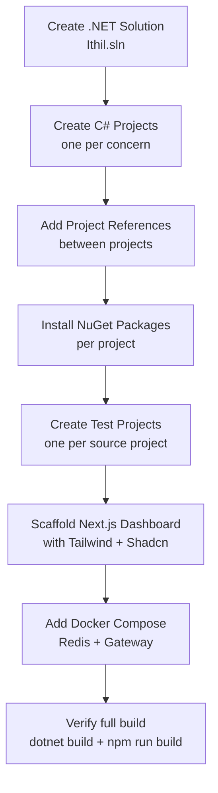

# Sprint 0: Project Bootstrap

## What It Is

Before any feature code can be written, the solution structure needs to exist. This sprint creates the .NET solution, all C# projects, the Next.js dashboard scaffold, and installs every library that downstream sprints depend on. Nothing in Sprints 1–8 can start until this is done.

---

## Flow



---

## Acceptance Criteria

- [ ] `Ithil.sln` exists at the repo root and loads in Visual Studio / Rider without errors
- [ ] All C# projects below exist and are referenced in the solution
- [ ] `dotnet build` at the repo root produces zero errors and zero warnings
- [ ] All NuGet packages listed below are installed in the correct projects
- [ ] All test projects exist, reference their source project, and `dotnet test` runs (no tests yet, just runs and exits clean)
- [ ] `Ithil.SourceGenerator` targets `netstandard2.0` (Roslyn requirement)
- [ ] All other projects target `net9.0`
- [ ] `dashboard/` folder contains a working Next.js 15 app with TypeScript, Tailwind CSS v4, and Shadcn/UI installed
- [ ] `npm run build` inside `dashboard/` succeeds
- [ ] `docker/docker-compose.yml` defines a Redis service that starts with `docker compose up`
- [ ] No placeholder or tutorial boilerplate code remains (delete the default `WeatherForecast` controller, etc.)

---

## Solution Structure

```
Ithil/
├── Ithil.sln
├── src/
│   ├── Ithil.Core/
│   ├── Ithil.Attributes/
│   ├── Ithil.SourceGenerator/
│   ├── Ithil.Gateway/
│   ├── Ithil.Cache/
│   ├── Ithil.Budget/
│   ├── Ithil.Privacy/
│   └── Ithil.Management/
├── tests/
│   ├── Ithil.Core.Tests/
│   ├── Ithil.Attributes.Tests/
│   ├── Ithil.Cache.Tests/
│   ├── Ithil.Budget.Tests/
│   └── Ithil.Privacy.Tests/
├── dashboard/
│   └── ithil-dashboard/        # Next.js app
├── docker/
│   └── docker-compose.yml
├── CLAUDE.md
├── README.md
└── plan.md
```

---

## Projects

### `Ithil.Core` — `classlib`, `net9.0`

Shared models and interfaces used by every other project. No dependencies on other Ithil projects.

**Purpose:** Avoid circular references. If it needs to be shared, it lives here.

```
Ithil.Core/
└── (empty at bootstrap — models added in Sprint 1)
```

---

### `Ithil.Attributes` — `classlib`, `net9.0`

The `[AgentTool]` attribute and its supporting types. Designed to be shipped as a standalone NuGet package that developers install in their own APIs.

**References:** `Ithil.Core`

```
Ithil.Attributes/
└── (empty at bootstrap — attribute added in Sprint 1)
```

---

### `Ithil.SourceGenerator` — `classlib`, `netstandard2.0`

Roslyn Incremental Source Generator. Must target `netstandard2.0` — this is a hard Roslyn requirement, not a preference.

**References:** `Ithil.Attributes` (as an analyzer reference, not a project reference)

```
Ithil.SourceGenerator/
└── (empty at bootstrap — generator added in Sprint 2)
```

---

### `Ithil.Gateway` — `webapi`, `net9.0`

The main executable. YARP reverse proxy host, MCP endpoint registration, and the composition root where all services are wired together.

**References:** `Ithil.Core`, `Ithil.Cache`, `Ithil.Budget`, `Ithil.Privacy`, `Ithil.Management`

```
Ithil.Gateway/
├── Program.cs       # Minimal API host setup, service registration
└── appsettings.json # Connection strings, YARP routes (empty at bootstrap)
```

---

### `Ithil.Cache` — `classlib`, `net9.0`

Redis semantic cache. All cache read/write logic lives here.

**References:** `Ithil.Core`

```
Ithil.Cache/
└── (empty at bootstrap)
```

---

### `Ithil.Budget` — `classlib`, `net9.0`

Per-agent token ledger backed by Redis.

**References:** `Ithil.Core`

```
Ithil.Budget/
└── (empty at bootstrap)
```

---

### `Ithil.Privacy` — `classlib`, `net9.0`

PII scrubbing pipeline.

**References:** `Ithil.Core`

```
Ithil.Privacy/
└── (empty at bootstrap)
```

---

### `Ithil.Management` — `classlib`, `net9.0`

REST management API (agents CRUD, tool allowlists, budget configuration).

**References:** `Ithil.Core`

```
Ithil.Management/
└── (empty at bootstrap)
```

---

## NuGet Packages

Install these with `dotnet add package <name>`. Each row shows which project gets the package.

| Package | Project(s) | Why |
|---|---|---|
| `LanguageExt.Core` | All `src/` projects | `Option<T>`, `Seq<T>`, `Map<K,V>`, etc. |
| `Yarp.ReverseProxy` | `Ithil.Gateway` | Reverse proxy core |
| `StackExchange.Redis` | `Ithil.Cache`, `Ithil.Budget` | Redis client |
| `Polly` | `Ithil.Gateway` | Circuit breaker |
| `Microsoft.AspNetCore.SignalR` | `Ithil.Gateway` | Real-time trace hub (already in ASP.NET — verify it's available) |
| `Microsoft.CodeAnalysis.CSharp` | `Ithil.SourceGenerator` | Roslyn APIs |
| `Microsoft.CodeAnalysis.Analyzers` | `Ithil.SourceGenerator` | Source generator tooling |
| `xunit` | All `tests/` projects | Test runner |
| `xunit.runner.visualstudio` | All `tests/` projects | IDE test runner integration |
| `Microsoft.NET.Test.Sdk` | All `tests/` projects | `dotnet test` support |
| `FluentAssertions` | All `tests/` projects | Readable test assertions |
| `coverlet.collector` | All `tests/` projects | Code coverage |

---

## Project References

```
Ithil.Gateway        → Ithil.Core, Ithil.Cache, Ithil.Budget, Ithil.Privacy, Ithil.Management
Ithil.Attributes     → Ithil.Core
Ithil.Cache          → Ithil.Core
Ithil.Budget         → Ithil.Core
Ithil.Privacy        → Ithil.Core
Ithil.Management     → Ithil.Core

Ithil.Core.Tests         → Ithil.Core
Ithil.Attributes.Tests   → Ithil.Attributes
Ithil.Cache.Tests        → Ithil.Cache
Ithil.Budget.Tests       → Ithil.Budget
Ithil.Privacy.Tests      → Ithil.Privacy
```

---

## Dashboard Scaffold

Inside `dashboard/`, create the Next.js app:

```bash
npx create-next-app@latest ithil-dashboard \
  --typescript \
  --tailwind \
  --eslint \
  --app \
  --src-dir \
  --import-alias "@/*"
```

Then inside `dashboard/ithil-dashboard/`:

```bash
# Install Shadcn/UI
npx shadcn@latest init

# Install core Shadcn components used across the dashboard
npx shadcn@latest add button card table badge tabs
```

Delete the default Next.js demo content from `src/app/page.tsx` — replace with a bare placeholder:

```tsx
export default function Home() {
  return <main><h1>Ithil Dashboard</h1></main>;
}
```

---

## Docker Compose

`docker/docker-compose.yml` should define at minimum:

```yaml
services:
  redis:
    image: redis/redis-stack:latest
    ports:
      - "6379:6379"
      - "8001:8001"   # RedisInsight UI
    volumes:
      - redis-data:/data

volumes:
  redis-data:
```

We use `redis/redis-stack` (not plain `redis`) because the Semantic Cache feature requires the vector search module that only ships in Redis Stack.

---

## Verification Checklist (in place of unit tests)

Bootstrap is structural — there is no logic to unit test. Instead, verify these commands all pass before calling this sprint done:

```bash
# From repo root
dotnet build                  # Zero errors, zero warnings

dotnet test                   # Runs, exits 0 (no tests yet — that's fine)

# From dashboard/ithil-dashboard
npm run build                 # Next.js build succeeds

# From docker/
docker compose up -d          # Redis starts, port 6379 is accessible
docker compose down
```

Additionally verify in your IDE:
- Solution loads all projects without errors
- Each project's target framework is correct (`netstandard2.0` for SourceGenerator, `net9.0` for all others)
- NuGet restore completes without conflicts
