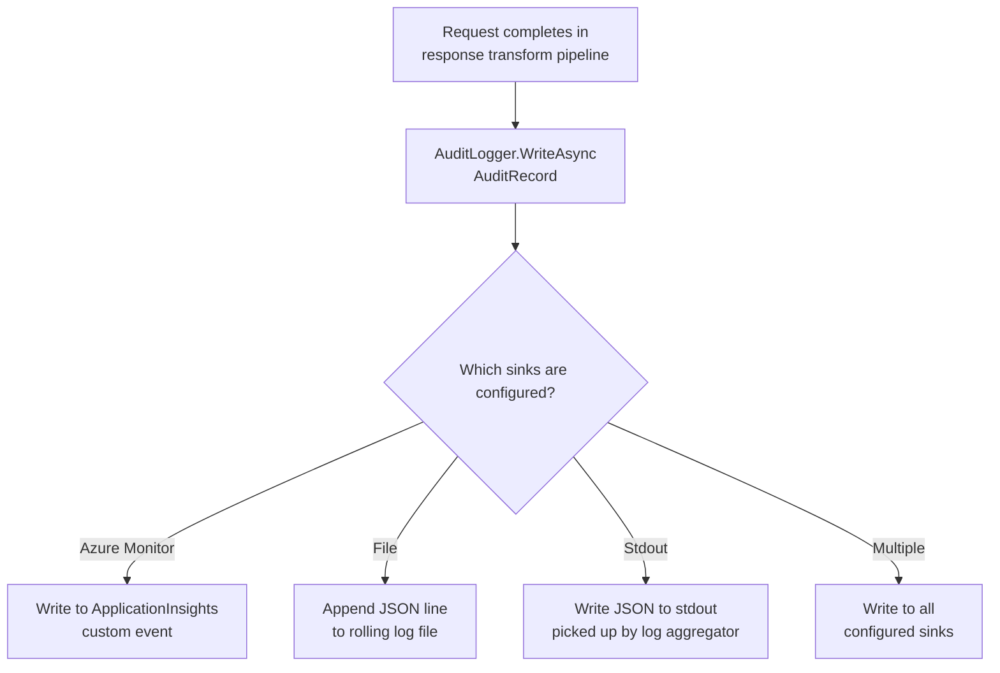

# Feature: Audit Log

## What It Is

A structured, append-only record of every agent request that flows through the gateway. Written as JSON lines (one JSON object per line) and pluggable into any sink: Azure Monitor, Datadog, Splunk, or a local file.

The audit log is the compliance and forensics layer — it answers questions like "which agent accessed patient records on Feb 21st?" long after the real-time trace feed has moved on.

**`StdoutAuditSink` is on by default.** Operators who configure nothing still get a structured
JSON Lines record on stdout, which any log aggregator (Datadog, Splunk, ELK, Loki) picks up
automatically. This is the right default for a governance tool — visibility should require
opt-out, not opt-in. Operators who do not want stdout output can disable it explicitly via
`options.Audit.DisableStdoutSink = true`.

---

## Output Channel Separation

Ithil has three distinct output channels and they must stay separate:

| Channel | Purpose | Default |
|---|---|---|
| `ITraceNotifier` → SignalR | Live real-time feed for the dashboard | Always on |
| `IAuditLogger` → sinks | Durable structured record for compliance and aggregators | StdoutSink on by default |
| `ILogger` → application log | Gateway internals — problems only | Standard ASP.NET behaviour |

`ITraceNotifier.NotifyAsync` must **never** write to `ILogger` for normal trace events.
The audit log is the product's logging mechanism. If both channels wrote the same events to
the application log, operators would have two overlapping records with no clear authoritative
source. If the SignalR broadcast itself fails, that failure is worth logging. Normal events
are not.

---

## Flow



---

## Acceptance Criteria

- [ ] Every completed request (success or error) produces exactly one audit record
- [ ] Blocked requests (budget exceeded, tool not allowed) also produce an audit record
- [ ] Cache hits produce an audit record with `cacheHit: true` and no `latencyMs` for the downstream call
- [ ] Audit record includes: `timestamp`, `traceId`, `agentId`, `toolName`, `parameters`, `outcome`, `tokensUsed`, `latencyMs`, `cacheHit`, `piiScrubbed`
- [ ] `parameters` in the audit record must have PII already scrubbed (same filter as response body)
- [ ] The audit logger does not block the response path — writes are fire-and-forget (enqueued to a background channel)
- [ ] If all sinks fail, a fallback write to `stderr` ensures no record is silently lost
- [ ] Sinks are pluggable via DI — adding a new sink doesn't change `AuditLogger`
- [ ] Log format is valid JSON Lines (one complete JSON object per newline)
- [ ] `StdoutAuditSink` is registered by default when `UseIthilGateway()` is called — no configuration required
- [ ] Operators can disable the stdout sink via `options.Audit.DisableStdoutSink = true`
- [ ] A `README.md` exists in `Ithil.Management/Audit/` explaining why stdout is on by default, how to disable it, and how to add additional sinks
- [ ] `ITraceNotifier.NotifyAsync` does not write to `ILogger` for normal trace events — only for broadcast failures

---

## Files & Functions

```
Ithil.Management/
└── Audit/
    ├── AuditLogger.cs
    │   └── class AuditLogger : IAuditLogger
    │       └── WriteAsync(AuditRecord record) → Task
    │           Enqueues: record to Channel<AuditRecord>
    │           Background worker drains channel and calls each IAuditSink
    │
    ├── AuditBackgroundWorker.cs
    │   └── class AuditBackgroundWorker : BackgroundService
    │       └── ExecuteAsync(CancellationToken) → Task
    │           Reads: from Channel<AuditRecord>
    │           Calls: each registered IAuditSink.WriteAsync(record)
    │           OnSinkFailure: writes to stderr as fallback
    │
    ├── AuditRecord.cs
    │   └── record AuditRecord
    │       ├── string Timestamp        (ISO 8601 UTC)
    │       ├── string TraceId
    │       ├── string AgentId
    │       ├── string ToolName
    │       ├── object Parameters       (PII-scrubbed)
    │       ├── string Outcome          ("success"|"error"|"blocked"|"cache-hit")
    │       ├── int? TokensUsed
    │       ├── int? LatencyMs
    │       ├── bool CacheHit
    │       ├── bool PiiScrubbed
    │       └── string? ErrorMessage
    │
    ├── AuditOptions.cs
    │   └── class AuditOptions
    │       └── bool DisableStdoutSink   (default: false)
    │
    ├── README.md                        -- REQUIRED: explains default-on stdout sink,
    │                                       how to disable it, and how to register custom sinks
    │
    └── Sinks/
        ├── IAuditSink.cs
        │   └── WriteAsync(AuditRecord record) → Task
        │
        ├── StdoutAuditSink.cs     → Writes JSON line to stdout (registered by default)
        ├── FileAuditSink.cs       → Appends JSON line to a rolling file
        └── ApplicationInsightsSink.cs → Writes as custom event to AppInsights

Ithil.Core/
└── Interfaces/
    └── IAuditLogger.cs
        └── WriteAsync(AuditRecord record) → Task
```

---

## Unit Testing Plan

Tests live in `Ithil.Management.Tests/Audit/`.

### Test: AuditLogger_Enqueues_DoesNotBlockCaller
- Call `WriteAsync` and measure that it completes in < 1ms
- (Verifies fire-and-forget behavior)

### Test: AuditBackgroundWorker_CallsAllSinks_ForEachRecord
- Register 2 mock sinks
- Enqueue 3 records
- Assert each sink's `WriteAsync` is called 3 times

### Test: AuditBackgroundWorker_WritesToStderr_WhenAllSinksFail
- Both sinks throw
- Assert stderr receives output (capture stderr in test)

### Test: AuditRecord_Outcome_IsBlockedForBudgetExceeded
- Build an `AuditRecord` for a budget-exceeded request
- Assert `Outcome == "blocked"`

### Test: AuditRecord_CacheHit_IsTrue_WhenServedFromCache
- Build record for a cache-hit request
- Assert `CacheHit == true`

### Test: AuditRecord_LatencyMs_IsNull_ForCacheHits
- Cache hit records don't have a downstream latency
- Assert `LatencyMs == null` when `CacheHit == true`

### Test: StdoutAuditSink_WritesValidJsonLine
- Write one `AuditRecord`
- Assert output is a single line of valid JSON (parseable)

### Test: FileAuditSink_AppendsToFile_NotOverwrites
- Write two records
- Assert both records appear in the output file, each on its own line

### Test: StdoutAuditSink_IsRegisteredByDefault
- Build a minimal `IServiceCollection` using `UseIthilGateway()` with no audit options set
- Assert that an `IAuditSink` of type `StdoutAuditSink` is registered

### Test: StdoutAuditSink_IsNotRegistered_WhenDisabled
- Configure `options.Audit.DisableStdoutSink = true`
- Assert that no `StdoutAuditSink` is registered in the container

### Test: AuditRecord_Parameters_ArePiiScrubbed
- Parameters contain an email address
- Before writing, the scrubber should have already run
- (Integration test verifying the pipeline scrubs params before building the audit record)
