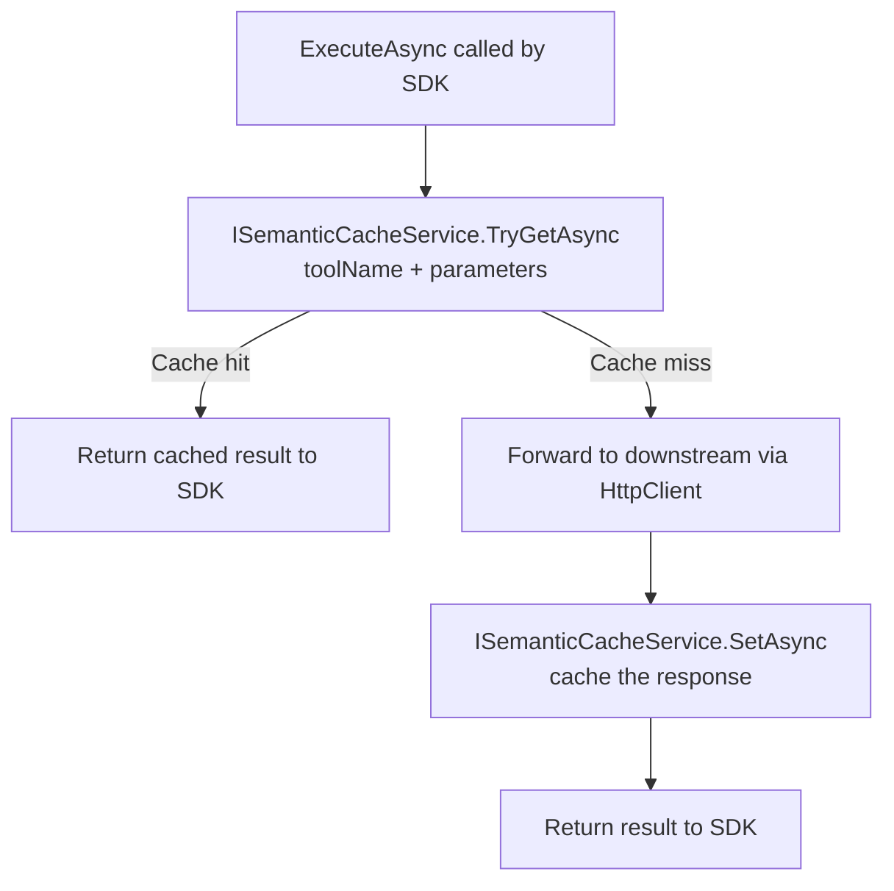
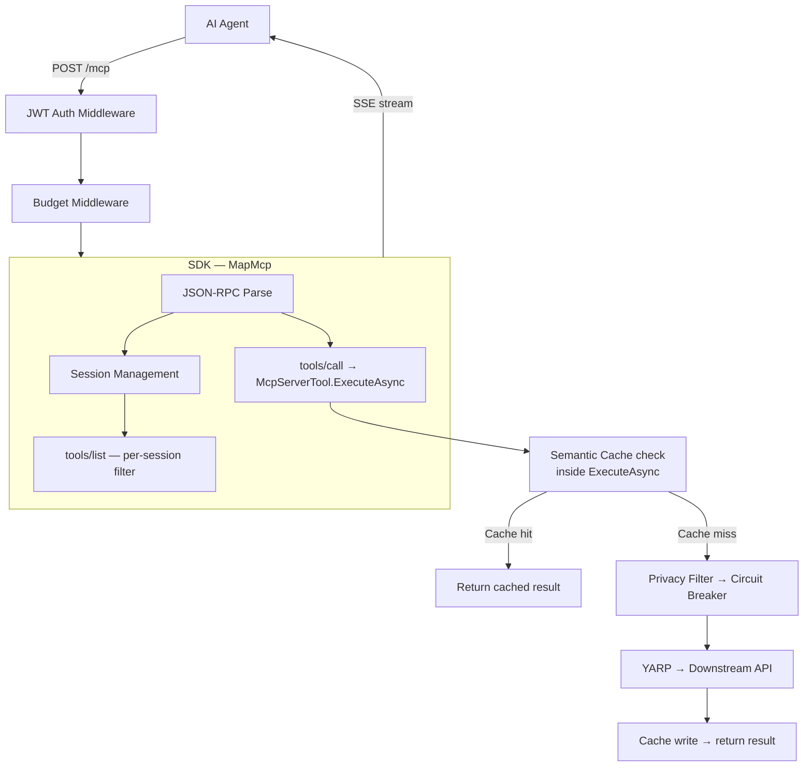
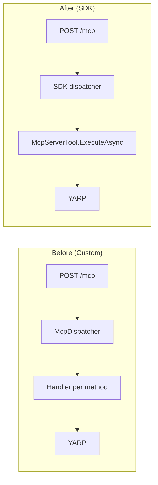
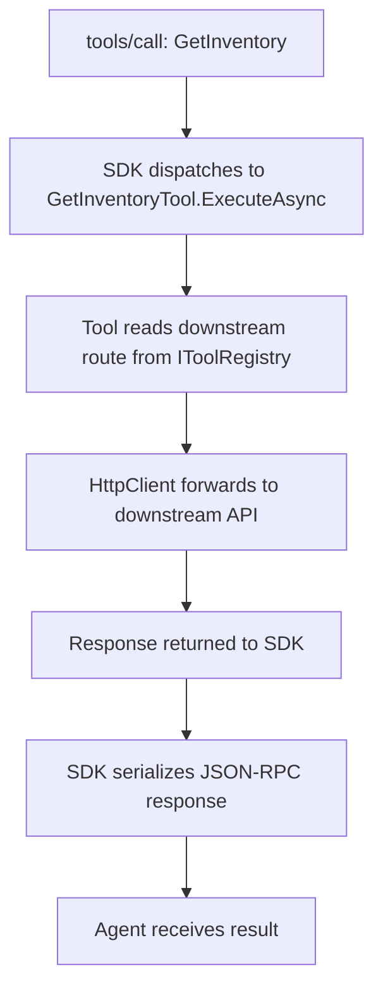
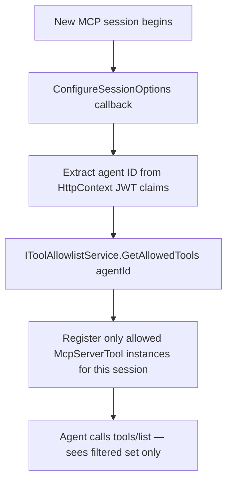
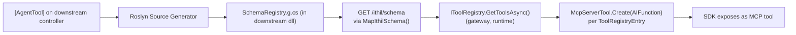

# Feature: MCP C# SDK Migration

## What It Is

Replace Ithil's hand-rolled JSON-RPC 2.0 / MCP protocol layer with the official
`ModelContextProtocol.AspNetCore` NuGet package. The SDK handles protocol parsing,
dispatch, SSE transport, session lifecycle, and tool schema serialization. Ithil's
governance layer (budget, privacy, tracing, circuit breaker, allowlist) is unaffected —
it lives in ASP.NET Core middleware and DI services that wrap the SDK, not inside it.

**NuGet package:** `ModelContextProtocol.AspNetCore` (Apache 2.0 / MIT)
**SDK version target:** 1.1.0+

---

## What Gets Deleted

| File / Folder | Reason |
|---|---|
| `Ithil.Gateway/Endpoints/McpEndpointExtensions.cs` | Replaced by `app.MapMcp()` |
| `Ithil.Gateway/Endpoints/SseEmitter.cs` | Replaced by SDK SSE transport |
| `Ithil.Gateway/Mcp/McpDispatcher.cs` | Replaced by SDK dispatcher |
| `Ithil.Gateway/Mcp/Handlers/InitializeHandler.cs` | Replaced by SDK |
| `Ithil.Gateway/Mcp/Handlers/ToolsListHandler.cs` | Replaced by per-session filtering |
| `Ithil.Gateway/Mcp/Handlers/ToolsCallHandler.cs` | Replaced by `[McpServerTool]` wrappers |
| `Ithil.Gateway/Mcp/Handlers/ResourcesListHandler.cs` | Replaced by SDK |
| `Ithil.Gateway/Mcp/Handlers/ResourcesReadHandler.cs` | Replaced by SDK |
| `Ithil.Gateway/Middleware/SemanticCacheMiddleware.cs` | Cache moves into tool proxy (see below) |
| `Ithil.Core/Models/JsonRpcRequest.cs` | Replaced by SDK types |
| `Ithil.Core/Models/JsonRpcResponse.cs` | Replaced by SDK types |
| `Ithil.Core/Models/JsonRpcError.cs` | Replaced by SDK types |

---

## What Does NOT Change

- `Ithil.Budget` — budget middleware is untouched; fires on the raw HTTP request before the SDK processes the body, so `429` rejections still work correctly
- `Ithil.Privacy` — privacy filter pipeline is untouched; runs inside each tool proxy after the downstream response is received, before returning to the SDK
- `Ithil.Gateway` circuit breaker, SignalR tracing, JWT auth — all untouched
- `Ithil.Attributes` — `[AgentTool]` attribute is untouched
- `Ithil.SourceGenerator` — emits `SchemaRegistry.g.cs` (unchanged); proxy class approach was abandoned (see below)
- YARP configuration — runs as catch-all middleware after `MapMcp()`, no conflict

---

## Semantic Cache — Architectural Change Required

The semantic cache **cannot remain as HTTP middleware** after this migration. The SDK owns JSON-RPC body parsing. Middleware runs before the body is parsed, so a cache middleware cannot inspect the tool name and parameters without duplicating the SDK's work — which is fragile and wrong.

**Required approach:** inject `ISemanticCacheService` directly into each tool proxy's `ExecuteAsync` method. The cache check and write happen inside the tool call, not in the middleware pipeline.



The `ISemanticCacheService` interface is unchanged. Only where it is called changes — from middleware to inside the tool proxy. The `Ithil.Cache` project is untouched; `SemanticCacheMiddleware.cs` in `Ithil.Gateway` is deleted.

---

## Resource Support

MCP resources (`resources/list`, `resources/read`) are **out of scope for v1**. The SDK handles the protocol-level responses. If Ithil's downstream services expose MCP resources, a future feature will add resource proxy classes analogous to `[McpServerTool]` proxies. The deletion of `ResourcesListHandler` and `ResourcesReadHandler` intentionally drops resource support until that future feature ships.

---

## Architecture After Migration



---

## Request Flow Comparison



---

## Tool Call Forwarding Pattern

The SDK calls a C# method for every `tools/call`. In Ithil, that method is a thin
proxy that forwards through YARP / HttpClient to the downstream REST endpoint.
The source generator emits these proxy classes at compile time.



---

## Per-Session Tool Allowlist

The SDK's `ConfigureSessionOptions` callback replaces `ToolsListHandler`'s filtering.
It runs once per new agent session and restricts which tools are visible and callable.



---

## Source Generator Change

`Ithil.SourceGenerator` **retains the `SchemaRegistry.g.cs` approach** — no change to the emitted output. The proxy class approach (`[McpServerToolType]` generated classes) was abandoned because it requires the MCP server and the `[AgentTool]` methods to be in the same compiled assembly. Ithil is a gateway: it never references downstream assemblies at compile time.

The flow is:
- Downstream app: `[AgentTool]` method → source generator → `SchemaRegistry.g.cs` (in downstream assembly)
- Downstream app: `MapIthilSchema()` exposes `GET /ithil/schema` from `SchemaRegistry.Tools`
- Gateway: `IToolRegistry.GetToolsAsync()` fetches and caches the schema at runtime
- Gateway: Creates `McpServerTool` instances dynamically from `ToolRegistryEntry` using `McpServerTool.Create(AIFunction)`
- SDK handles all protocol work from there



---

## Acceptance Criteria

- [ ] `POST /mcp` without JWT returns `401` (JWT middleware runs before SDK)
- [ ] `POST /mcp — initialize` returns protocol version and server capabilities
- [ ] `POST /mcp — notifications/initialized` receives no response (notifications are one-way per MCP spec; the server must not reply)
- [ ] `POST /mcp — tools/list` returns only tools in the authenticated agent's allowlist
- [ ] `POST /mcp — tools/call` forwards to the correct downstream endpoint via YARP/HttpClient
- [ ] `GET /mcp/sse` opens an SSE stream with correct `Content-Type: text/event-stream`
- [ ] Budget middleware still fires and rejects with `429` when limit exceeded
- [ ] Privacy filter still runs on all tool call responses
- [ ] Circuit breaker still trips on repeated downstream failures
- [ ] SignalR trace events still fire for every tool call
- [ ] All existing governance integration tests pass with no changes to test logic
- [ ] No custom `JsonRpcRequest` / `JsonRpcResponse` types remain in `Ithil.Core`
- [ ] `SemanticCacheMiddleware.cs` is deleted from `Ithil.Gateway`; cache is verified working via injection into tool proxies
- [ ] `SemanticCacheService_ToolsCallHandler` tests are replaced by `ToolProxy_ReturnsCachedResult_WhenCacheHit`

---

## Files & Functions

### New / Modified

```
Ithil.Gateway/
├── Program.cs (or Startup)
│   ├── builder.Services.AddMcpServer()         — register SDK
│   │   .WithHttpTransport()
│   │   .AddAuthorizationFilters()
│   └── app.MapMcp()                             — register MCP routes
│
└── Mcp/
    └── McpSessionConfiguration.cs
        └── static ConfigureSession(HttpContext, McpServerSessionOptions) → void
            Extracts agent ID from JWT, calls IToolAllowlistService,
            registers only allowed McpServerTool instances for this session

Ithil.SourceGenerator/
└── AgentToolGenerator.cs (unchanged)
    Still emits SchemaRegistry.g.cs with ToolEntry records.
    Proxy class approach was abandoned — see Source Generator Change section.
```

### Deleted (see table above)

---

## Open Questions / Blockers

### ~~SDK API — Per-Session Tool Filtering~~ ✅ DONE
`McpSessionConfiguration.cs` implemented using `McpServerOptions.ToolCollection` and `McpServerTool.Create(AIFunction)`. SDK API confirmed against installed package.

### ~~Auth Gap — `/mcp` Requires `.RequireAuthorization()`~~ ✅ DONE
JWT middleware configured and `app.MapMcp()` route group has `.RequireAuthorization()` applied.

### ~~IToolAllowlistService — Missing Enumeration Method~~ ✅ DONE
`TryGetToolAllowlistAsync(string agentId)` added to `IToolAllowlistService` and implemented in `ToolAllowlistService`.

---

## Unit Testing Plan

Tests live in `Ithil.Gateway.Tests/Mcp/` and `Ithil.SourceGenerator.Tests/`.

### Test: Session_FiltersTools_ByAgentAllowlist
- Register three tools: `GetInventory`, `CreateOrder`, `DeleteUser`
- Configure allowlist for agent "agent-A": only `GetInventory` and `CreateOrder`
- Call `ConfigureSession` with a mocked `HttpContext` carrying agent-A's JWT
- Assert only two tools are registered in the resulting session options

### Test: Session_RejectsCall_ForDisallowedTool
- Agent-A's allowlist does not include `DeleteUser`
- Attempt `tools/call: DeleteUser` in a session configured for agent-A
- Assert `403` or MCP error response — tool not found in session

### Test: McpPost_Returns401_WithNoToken
- Call `POST /mcp` with no Authorization header through the full middleware pipeline
- Assert `401 Unauthorized` before SDK processes the request

### Test: BudgetMiddleware_Returns429_WhenExceeded
- Configure agent budget at 0 remaining tokens
- Call `POST /mcp — tools/call` with valid JWT
- Assert `429 Too Many Requests` before SDK processes the request

### Test: ToolProxy_ForwardsToCorrectDownstreamRoute
- Register a generated `[McpServerTool]` proxy for `GetInventory` pointing to `/api/inventory`
- Call the proxy's `ExecuteAsync` with mocked `HttpClient`
- Assert the forwarded request hits `/api/inventory` with correct parameters

### Test: ToolProxy_AppliesPrivacyFilter_OnResponse
- Downstream returns a response containing a PII marker
- Privacy filter is registered in DI
- Assert the value returned from `ExecuteAsync` has PII scrubbed

### Test: SseEndpoint_SetsCorrectContentType
- Call `GET /mcp/sse` with valid JWT
- Assert response `Content-Type: text/event-stream`
- Assert response `Cache-Control: no-cache`
