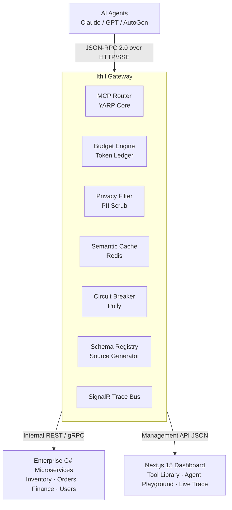
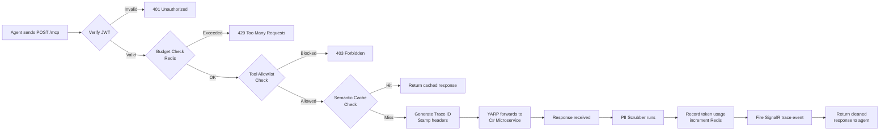
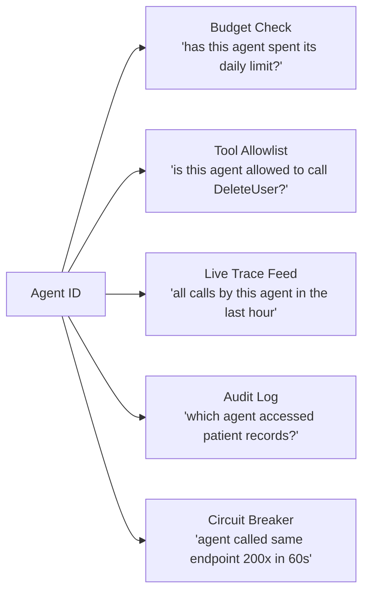

# Ithil — Architecture Overview

**Tagline:** The Agentic Governance Layer for Enterprise .NET Backends
**Stack:** C# / .NET 9+, TypeScript / Next.js 15, Redis, YARP, SignalR, MCP
**Date:** 2026-02-22

---

## What It Is

Ithil is a .NET middleware gateway that sits in front of existing C# enterprise APIs and translates them into Model Context Protocol (MCP)-compliant Tool Servers. It makes AI agents (Claude, GPT, AutoGen, etc.) safe, observable, and cost-controlled when interacting with private enterprise data.

| Problem | Solution |
|---|---|
| Agents hallucinate when calling messy REST APIs | Auto-generates MCP-compliant schemas from C# controllers at compile time |
| No visibility into what agents are doing | Real-time SignalR tracing dashboard |
| Agents loop and call destructive endpoints | Circuit breaker + per-agent daily token budgets |
| Redundant LLM calls cost thousands per month | Semantic caching in Redis keyed on intent |
| PII leaking to LLMs | Privacy filter scrubs data before it leaves the gateway |

---

## System Architecture



---

## Request Lifecycle



---

## Agent ID — Why It Matters

The agent ID is the key that makes every governance feature possible:



---

## Project Structure

```
Ithil/
├── src/
│   ├── Ithil.Gateway/          # YARP-based gateway host
│   ├── Ithil.Core/             # Shared models, interfaces
│   ├── Ithil.Attributes/       # [AgentTool] attribute + metadata
│   ├── Ithil.SourceGenerator/  # Roslyn Source Generator
│   ├── Ithil.Cache/            # Redis semantic cache
│   ├── Ithil.Budget/           # Token ledger + per-agent limits
│   ├── Ithil.Privacy/          # PII scrubbing pipeline
│   └── Ithil.Management/       # REST management API for dashboard
├── sdk/
│   └── ithil-ts/               # TypeScript SDK (npm package)
├── dashboard/
│   └── ithil-dashboard/        # Next.js 15 dashboard
└── docker/
    └── docker-compose.yml
```

---

## Build Sequence

| Sprint | Feature |
|---|---|
| 1 | AgentTool Attribute |
| 2 | YARP Gateway + MCP Endpoints |
| 3 | Roslyn Source Generator |
| 4 | Budget Engine + Agent Identity (JWT) |
| 5 | Dashboard v1 (Tool Library + Agent Registry) |
| 6 | SignalR Real-Time Tracing |
| 7 | Semantic Cache + Privacy Filter |
| 8 | Circuit Breaker + Audit Log |

---

## Revenue Model

**License:** AGPL v3 + Commercial License Exception

The code is fully public. AGPL requires any commercial product built on Ithil to open-source its entire stack. Companies building on private enterprise backends will not do that — they purchase a commercial license instead.

No request limits. No agent identity caps. No per-request charges. The license is the product.

| Tier | Price | What They Get |
|---|---|---|
| Non-Commercial | Free | Full code under AGPL. Self-host. No commercial use. |
| Commercial Small | $149/mo or $1,490/yr | Commercial license, self-host, best-effort email support. |
| Commercial Business | $499/mo or $4,990/yr | Commercial license, self-host, email support with committed 48h response. |
| Enterprise | Contact | Custom contract and SLA negotiated per customer. |

---

## Key Concepts Reference

- **Reverse Proxy:** Sits in front of servers, intercepting inbound requests. YARP lets us write proxy logic in C# with full DI access.
- **Trace ID:** A random ID generated at request entry, stamped on every forwarded hop via `X-Ithil-TraceId` header. Ties scattered logs together.
- **MCP (Model Context Protocol):** JSON-RPC 2.0 protocol for agent-to-tool communication. All traffic is `POST`, action encoded in `method` field.
- **`/.well-known/mcp`:** Discovery endpoint. Agents hit this first to get the full tool manifest before any tool calls.
- **Tools vs Resources:** Tools are verbs (call a function). Resources are nouns (read a document into context).
