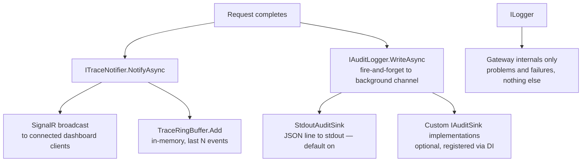

# Ithil Observability Architecture

> Read this before touching any code in this folder. These three systems are easy to confuse.
> They have different jobs and must stay separate.

Ithil has three distinct observability outputs:



---

## ITraceNotifier → SignalR

**What:** Broadcasts each event in real time to every connected dashboard client.  
**When:** Fires for every request that completes through the gateway pipeline.  
**Retention:** None on its own. If no client is connected, the event is not stored by this
channel. The ring buffer (below) provides short-term memory separately.  
**Rule:** Never write to `ILogger` for normal events. Only log if the SignalR broadcast
itself fails.

---

## TraceRingBuffer

**What:** In-memory circular buffer holding the last N trace events (default 500).  
**When:** Written to at the same time as the SignalR broadcast, inside `TraceNotifier.NotifyAsync`.  
**Retention:** Ephemeral. Cleared on process restart. Oldest events drop off when full.  
**Purpose:** Gives the dashboard something to display on connect without waiting for new
events to arrive.

A ring buffer is a fixed-size array that overwrites its oldest entry when full. Memory usage
is known at startup and never changes — there are no allocations or GC pressure during
normal operation.

---

## IAuditLogger → sinks

**What:** Durable, structured, append-only record of every request.  
**When:** Fires for every completed request, including blocked requests and cache hits.  
**Retention:** Permanent, determined by the configured sink.  
**Purpose:** Compliance, forensics, historical queries. Answers "what happened last Tuesday."

---

## ILogger

**What:** Standard ASP.NET application logging.  
**When:** Only when something that should work is not working — SignalR broadcast failure,
sink write failure, configuration error.  
**Purpose:** Gateway health and troubleshooting. Should be quiet during normal operation.

---

## Configuration Reference

### Trace Buffer

The buffer size controls both how many events are stored server-side and how many the
dashboard receives on initial connect. One setting, one place to tune.

```json
// appsettings.json
{
  "Ithil": {
    "Trace": {
      "BufferSize": 1000
    }
  }
}
```

Default: `500`. When the buffer is full, the oldest event is silently overwritten — this is
not an error. The buffer is intentionally cleared on process restart; the audit log handles
durable history.

### Audit Log

The stdout sink is on by default so structured logs flow into any log aggregator that reads
container stdout (Datadog, Loki, CloudWatch, etc.) without extra configuration.

```json
// appsettings.json — to disable stdout sink:
{
  "Ithil": {
    "Audit": {
      "DisableStdoutSink": true
    }
  }
}
```

To add a custom sink without touching `AuditLogger`, register it in DI:

```csharp
builder.Services.AddSingleton<IAuditSink, MyCustomAuditSink>();
```

Multiple sinks can be registered; `AuditLogger` fans out to all of them.

### SignalR Backplane (multi-instance deployments)

When more than one Gateway instance runs behind a load balancer, a client connected to
instance A will not receive events broadcast from instance B unless a backplane is
configured. Without a backplane, dashboard clients see only the traffic that hits their
specific instance.

Two options:

**Redis backplane** — events are shared across all instances via Redis pub/sub:

```csharp
builder.Services.AddSignalR().AddStackExchangeRedis("your-redis-connection-string");
```

**Sticky sessions** — the load balancer routes each client to the same instance every time.
No Redis dependency, but clients reconnecting after an instance restart may land on a
different instance and lose continuity.

For most deployments, the Redis backplane is the right choice because it requires no
load-balancer configuration and handles instance restarts transparently.

See `Ithil.Dashboard/Hubs/README.md` for the full backplane discussion.
